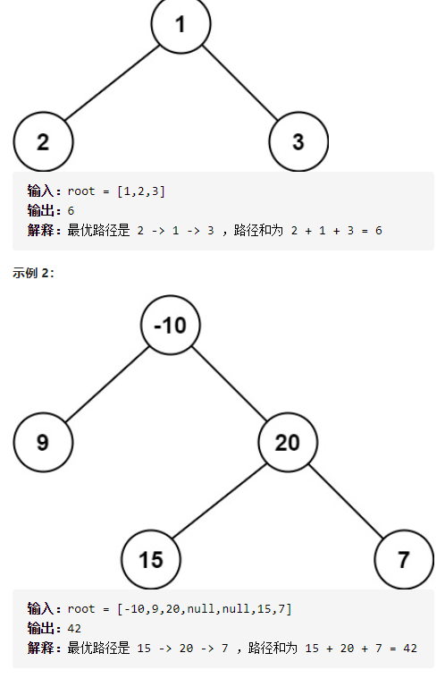
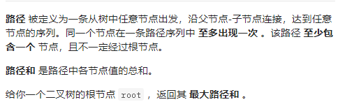

二叉树中的最大路径和



详细思路

dfs1，求出以root为顶点的链表的最大路径和，只需要dfs遍历一遍，每一次都调用dfs1求出以root为顶点的树的最大路径和，更新最大的答案就行了，那么dfs1怎么求呢？以左孩子和右孩子为顶点的链表的最大路径和较大的+root->val，当然如果小于等于0不算入

精确定义

dfs，形参root，求出以root为顶点的链表的最大路径和，root为空临界返回0，最后返回

```c
class Solution {
public:
    int maxPathSum(TreeNode* root) {
        int ans=-0x3f3f3f3f;
        dfs(root,ans);
        return ans;
    }
    void dfs(TreeNode*root,int&ans){
        if(!root)return ;
        int leftVal=max(0,dfs1(root->left));
        int rightVal=max(0,dfs1(root->right));
        ans=max(ans,root->val+leftVal+rightVal);
        dfs(root->left,ans);
        dfs(root->right,ans);
    }
    int dfs1(TreeNode*root){
        if(!root)return 0;
        int leftVal=max(0,dfs1(root->left));
        int rightVal=max(0,dfs1(root->right));
        return root->val+max(leftVal,rightVal);
    }
};
```

踩过的坑

​    return root->val+max(leftVal,rightVal);

​    ans=max(ans,root->val+leftVal+rightVal);

dfs1求以root为头结点的链表的最大路径和

dfs求以root为根结点的树的最大路径和  

所以一个是max，一个是+

​    int rightVal=max(0,dfs1(root->right));

求链表时，小于等于0的我不要，只要头结点就够了

​    int rightVal=max(0,dfs1(root->right));

求树时，小于等于0的链表我不要，只要头结点就够了

详细思路

递归，并不一定要在返回值才能作为答案，有时候，返回值只是为了实现dfs的功能，更新答案

dfs的中间不断更新

在dfs求root为头结点的链表最大路径和，然后ans并不是在返回值求到，而是在

在dfs过程中找机会算出来，因为可以求左右孩子

节点作为头结点的链表的最大路径和，然后更新答案，然后最后返回

精确定义

dfs形参root求以root为头结点的链表的最大路径和

ans树的最大路径和

```c
class Solution {
public:
    int maxPathSum(TreeNode* root) {
        int ans=-0x3f3f3f3f;
        dfs(root,ans);
        return ans;
    }
    int dfs(TreeNode*root,int &ans){
        if(!root)return 0;
        int leftVal=max(0,dfs(root->left,ans));
        int rightVal=max(0,dfs(root->right,ans));
        ans=max(ans,root->val+leftVal+rightVal);
        return root->val+max(leftVal,rightVal);

    }
};
```

