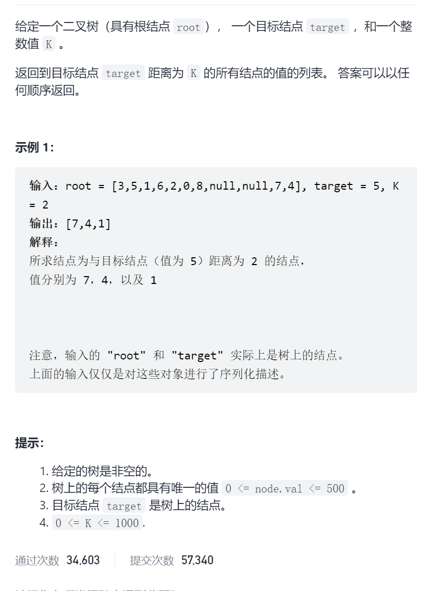
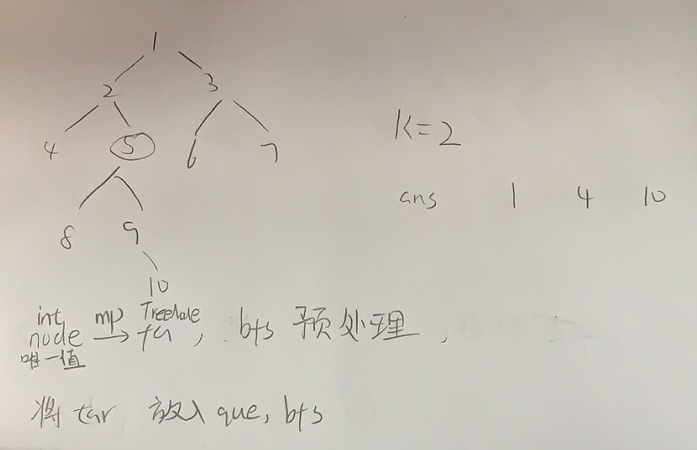

要么最近公共祖先，找到祖先的同时记录到祖先的距离。

要么

二叉树中所有距离为K的节点



抽象图一二ij



```c
class Solution {
public:
    vector<int> distanceK(TreeNode* root, TreeNode* target, int k) {
        unordered_map<int,TreeNode*>node2fa;
        queue<TreeNode*>que;
        que.push(root);
        while(!que.empty()){
            for(int sz=que.size();sz>0;sz--){
                TreeNode*fa=que.front();que.pop();
                if(fa->left){
                    node2fa[fa->left->val]=fa;
                    que.push(fa->left);
                }
                if(fa->right){
                    node2fa[fa->right->val]=fa;
                    que.push(fa->right);
                }
            }
        }
        unordered_set<int>vis;
        que.push(target);
        vector<int>ans;
        vis.insert(target->val);
        int cnt=0;
        while(!que.empty()){
            for(int sz=que.size();sz>0;sz--){
                TreeNode*cur=que.front();que.pop();
                if(cnt==k){
                    ans.push_back(cur->val);
                    continue;
                }
                if(cur->left&&vis.count(cur->left->val)==0){
                    que.push(cur->left);
                    vis.insert(cur->left->val);
                }
                if(cur->right&&vis.count(cur->right->val)==0){
                    que.push(cur->right);
                    vis.insert(cur->right->val);
                }
                if(node2fa.count(cur->val)&&vis.count(node2fa[cur->val]->val)==0){
                    que.push(node2fa[cur->val]);
                    vis.insert(node2fa[cur->val]->val);
                }
            }
            cnt++;
        }
        return ans;
    }
};
```


