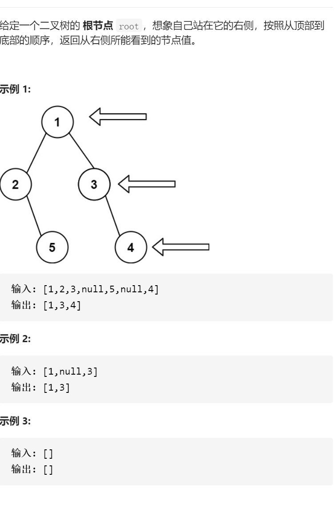

二叉树的右视图



变量简洁正确完整思路

层序遍历，poppush左右，固定大小，每个大小最后一次更新答案

```c
class Solution {
public:
    vector<int> rightSideView(TreeNode* root) {
        if(!root)return {};
        vector<int>ans;
        queue<TreeNode*>que;
        que.push(root);
        while(!que.empty()){
            for(int i=que.size()-1;i>=0;i--){
                TreeNode*tmp=que.front();que.pop();
                if(i==0)ans.push_back(tmp->val);
                if(tmp->left)que.push(tmp->left);
                if(tmp->right)que.push(tmp->right);
            }
        }
        return ans;
    }
};
```

