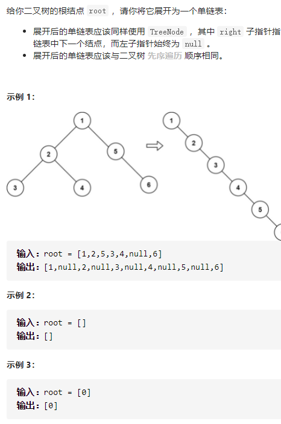

二叉树展开为链表



详细思路

前序遍历得到数组，对于数组内每一个节点，左子树为nullptr，右子树为下一个节点

精确定义

nodes前序遍历节点

```c
class Solution {
public:
    void flatten(TreeNode* root) {
        if(!root)return ;
        vector<TreeNode*>nodes;
        dfs(root,nodes);
        int n=nodes.size();
        for(int i=0;i<n-1;i++){
            nodes[i]->left=nullptr;
            nodes[i]->right=nodes[i+1];
        }
        nodes[n-1]->left=nullptr,nodes[n-1]->right=nullptr;
        return;
    }
    void dfs(TreeNode*root,vector<TreeNode*>&nodes){
        if(!root)return ;
        nodes.push_back(root);
        dfs(root->left,nodes);
        dfs(root->right,nodes);
    }
};
```

详细思路

模仿莫里斯遍历，六星图，找到cur，记录next，找到pre，pre-》next=cur-》right，

cur->right=nullptr;cur->right=next;完成一次循环，然后cur=cur->right，继续找到cur，

找到next，找到pre，继续看图pre->next=cur->right;cur->right=nullptr;cur->right=next

```c
class Solution {
public:
    void flatten(TreeNode* root) {
        TreeNode*cur=root;
        while(cur){
            if(cur->left){
                TreeNode*nex=cur->left,*pre=cur->left;
                while(pre->right)pre=pre->right;
                pre->right=cur->right;
                cur->left=nullptr;
                cur->right=nex;
            }
            cur=cur->right;
        }
        return;
    }
};
```

