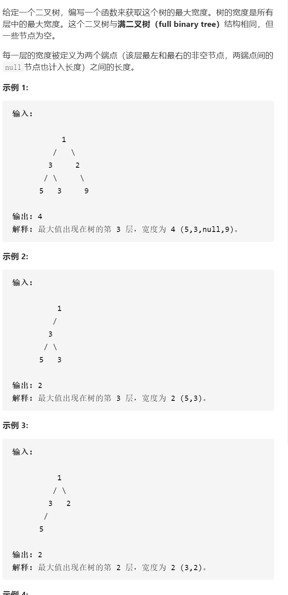
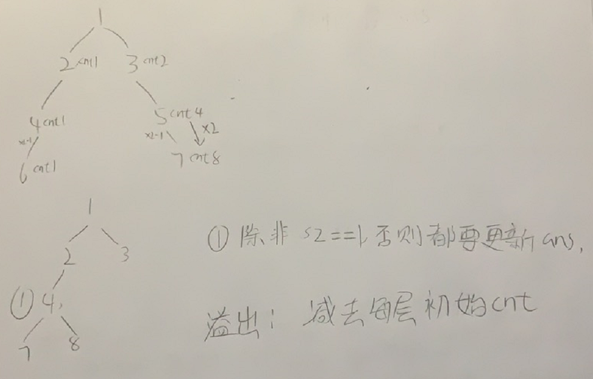

二叉树最大宽度

抽象图一二ij



```c
class Solution {
public:
    int widthOfBinaryTree(TreeNode* root) {
        queue<pair<TreeNode*,int>>que;
        que.push({root,1});
        int ans=INT_MIN;
        while(!que.empty()){
            bool flag=true;
            int n=que.size();
            int cntBeg;
            if(que.size()==1)flag=false;
            else cntBeg=que.front().second;
            int overflowHelp;
            for(int j=0;j<n;j++){
                if(j==0)overflowHelp=que.front().second;
                auto [tmp,cnt]=que.front();que.pop();
                if(tmp->left)que.push({tmp->left,cnt*2-1-overflowHelp});
                if(tmp->right)que.push({tmp->right,cnt*2-overflowHelp});
                if(j==n-1&&flag)ans=max(ans,cnt-cntBeg+1);
            }
        }
        return ans==INT_MIN?1:ans;
    }
};
```

