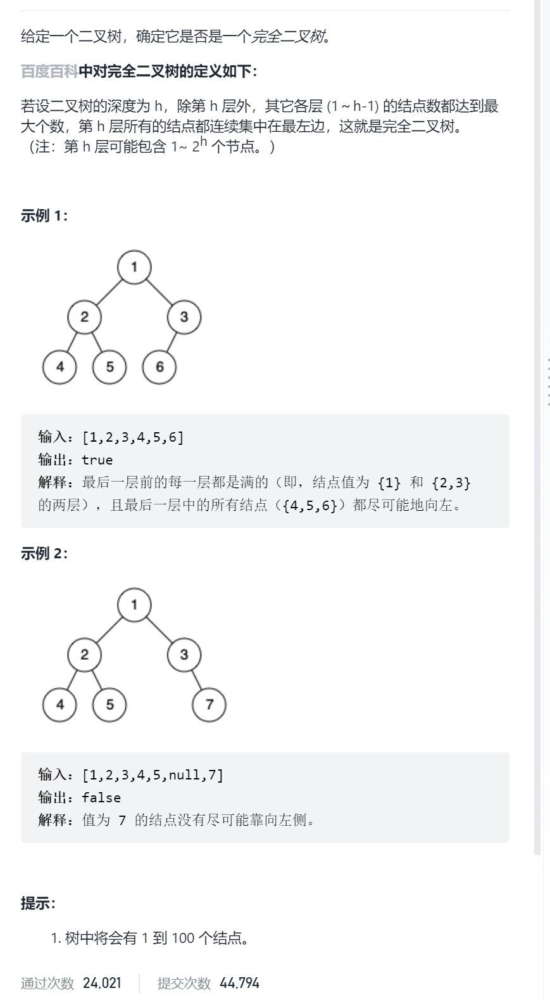
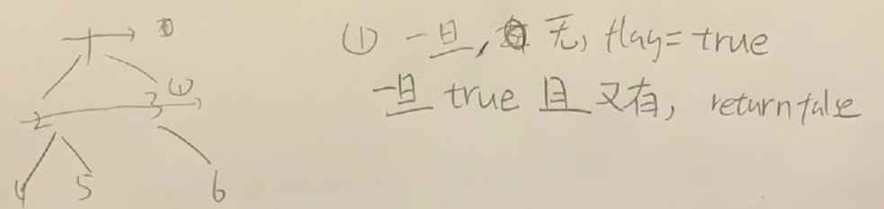

二叉树的完全性检验



抽象图一二ij



```c
class Solution {
public:
    bool isCompleteTree(TreeNode* root) {
        bool flag=false;
        queue<TreeNode*>que;
        que.push(root);
        while(!que.empty()){
            for(int sz=que.size();sz>0;sz--){
                TreeNode*cur=que.front();que.pop();
                if(cur->left){
                    if(flag==true)return false;
                    que.push(cur->left);
                }else flag=true;
                if(cur->right){
                    if(flag==true)return false;
                    que.push(cur->right);
                }else flag=true;
            }
        }
        return true;
    }
};
```

