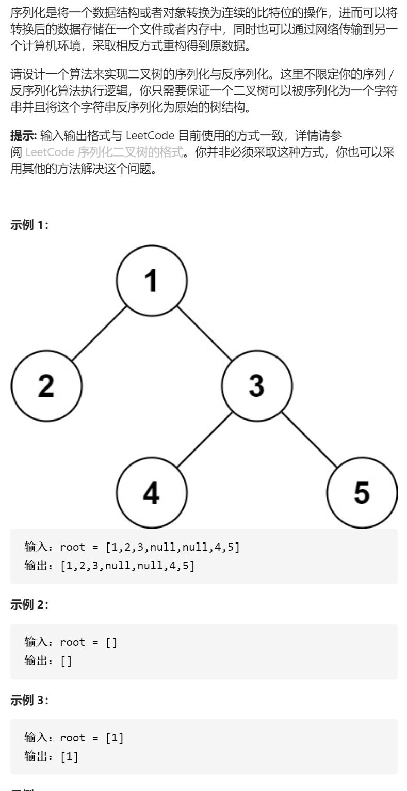

二叉树的序列化和反序列化



变量简洁正确完整思路

本质上是前序遍历过程记录，不同是遇到空节点也要记录，所以可以光靠同样一个前序遍历恢复

dfs，形参root将root序列化成字符串，前序遍历也就是root->val+ +左子树+ +右子树，边界返回null，利用stringstream很好处理空格的特性，用空格来分割

dfs，形参s，将s恢复成一棵树返回，也要按前序遍历先恢复root，再恢复左右

```c
class Codec {
public:
    string serialize(TreeNode* root) {
        if(!root)return "null";
        return to_string(root->val)+" "+serialize(root->left)+" "+serialize(root->right);
    }
    TreeNode* deserialize(string data) {
        stringstream ss(data);
        return dfs(ss);
    }
    TreeNode*dfs(stringstream&ss){
        string tmp;
        ss>>tmp;
        if(tmp=="null")return nullptr;
        TreeNode*root=new TreeNode(stoi(tmp));
        root->left=dfs(ss);
        root->right=dfs(ss);
        return root;
    }
};
```

