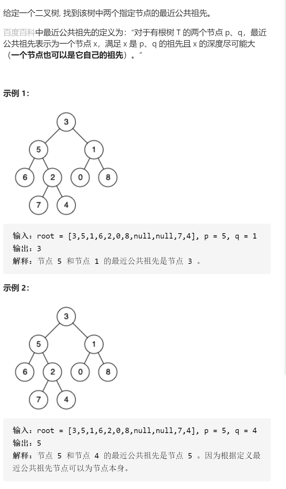

二叉树的最近公共祖先---经典的递归



dfs，参数rootpq判断p或者q是否在root树中，先leftright判断p或者q是否在左右子树，如果left有且right有，或者root本身就是p或q，更新全局答案，遇到空节点边界返回false，最后返回用left或者right或者root本身就是，注意的是dfs的定义是p或者q在

root树中，leftright表示p或者q在左子树右子树中，或者，而不是都在都不在

```c
class Solution {
public:
    TreeNode*ans;
    TreeNode* lowestCommonAncestor(TreeNode* root, TreeNode* p, TreeNode* q) {
        dfs(root,p,q);
        return ans;
    }
    bool dfs(TreeNode*root,TreeNode*p,TreeNode*q){
        if(!root)return false;
        bool left=dfs(root->left,p,q);
        bool right=dfs(root->right,p,q);
        if(left&&right||root->val==p->val||root->val==q->val){
            ans=root;
        }
        return left||right||root->val==p->val||root->val==q->val;
    }
};
```

变量简洁正确完整思路

dfs，形参root，p，q，在root是p或者q的祖先时返回root，先leftright找到左右子树

，如果left存在显然是p或者q的祖先，如果right存在显然是p或者q的祖先，如果left空

返回right，如果right空返回left，如果不为空，说明左子树时p或者q的祖先且右子树

是p或者q的祖先，返回root！！！！必须在向下找的过程中，如果root为p或者q，

应该提前返回

```c
class Solution {
public:
    TreeNode* lowestCommonAncestor(TreeNode* root, TreeNode* p, TreeNode* q) {
        if(!root)return nullptr;
        if(root==p||root==q)return root;
        TreeNode*left=lowestCommonAncestor(root->left,p,q);
        TreeNode*right=lowestCommonAncestor(root->right,p,q);
        if(!left)return right;
        if(!right)return left;
        if(left&&right)return root;
        return nullptr;
    }
};
```

