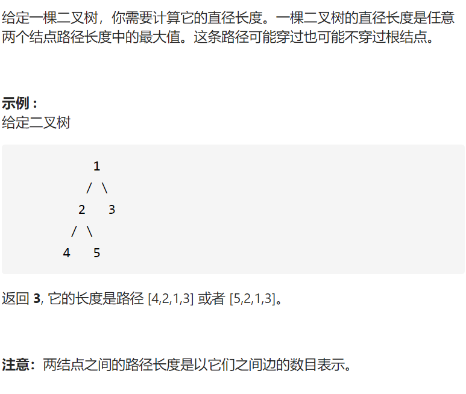
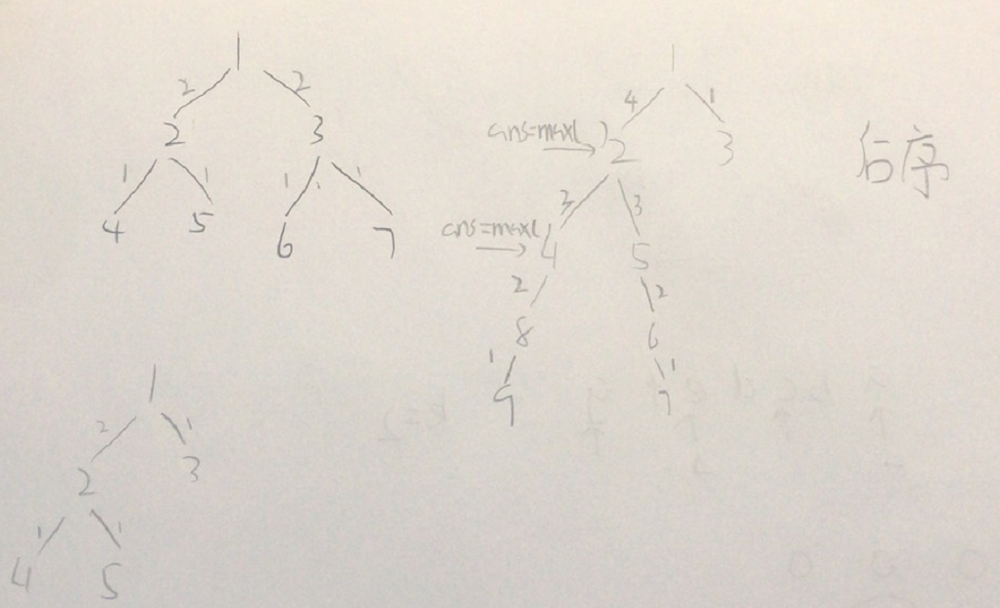

二叉树的直径



抽象图固定维护寻找



```c
class Solution {
public:
    int diameterOfBinaryTree(TreeNode* root) {
        int ans=0;
        dfs(root,ans);
        return ans;
    }
    int dfs(TreeNode*root,int &ans){
        if(!root)return 0;

        int leftLen=dfs(root->left,ans);
        int rightLen=dfs(root->right,ans);
        ans=max(ans,leftLen+rightLen);
        return max(leftLen,rightLen)+1;
    }
};
```

