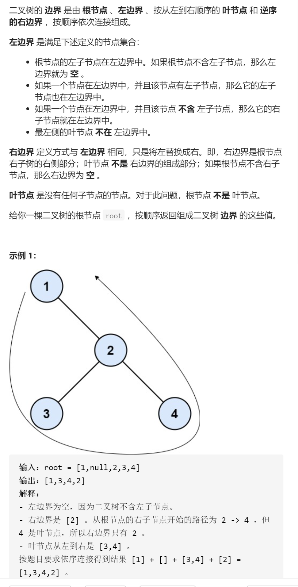
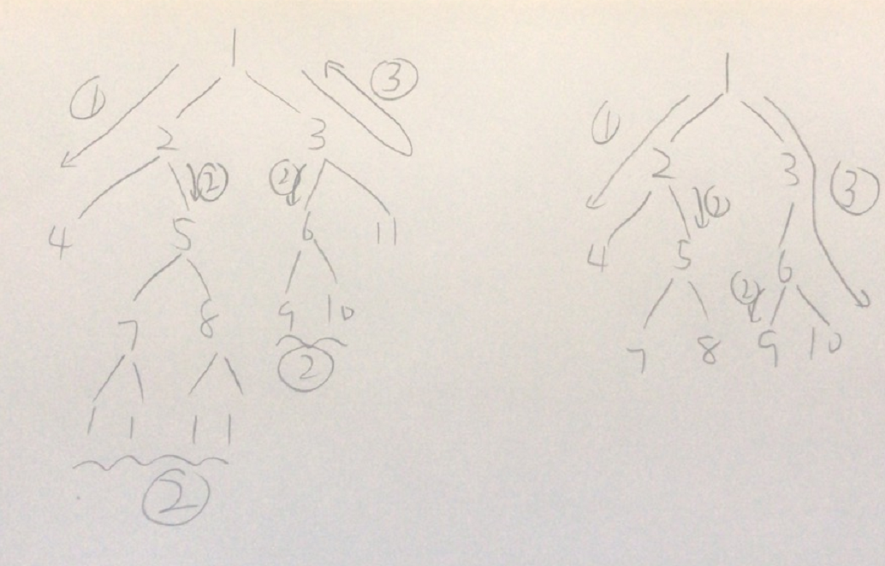

二叉树的边界



抽象图固定维护寻找



```c
class Solution {
public:
    vector<int>ans;
    vector<int> boundaryOfBinaryTree(TreeNode* root) {
        if(!root)return {};
        ans.push_back(root->val);
        dfs(root->left,1);
        dfs(root->right,3);
        return ans;
    }
    void dfs(TreeNode*root,int flag){
        if(!root)return;
        if(flag==1){
            ans.push_back(root->val);
            if(root->left){
                dfs(root->left,1);
                dfs(root->right,2);
            }else {
                dfs(root->right,1);
            }
        }else if(flag==2){
            if(!root->left&&!root->right){
                ans.push_back(root->val);
                return;
            }else {
                dfs(root->left,2);
                dfs(root->right,2);
            }
        }else if(flag==3){
            if(root->right){
                dfs(root->left,2);
                dfs(root->right,3);
            }else {
                dfs(root->left,3);
            }
            ans.push_back(root->val);
        }
    }
};

```


踩过的坑


else {

​        dfs(root->right,1);

​      }


else {

​        dfs(root->left,3);

​      }


就是第二副图