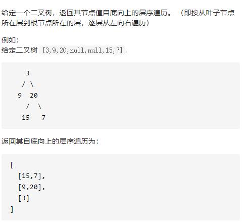

二叉树的层序遍历II

详细思路

层序遍历，push更新答案pop，固定大小，最后翻转答案

```c
class Solution {
public:
    vector<vector<int>> levelOrderBottom(TreeNode* root) {
        if(!root)return {};
        queue<TreeNode*>que;
        que.push(root);
        vector<vector<int>>ans;
        while(!que.empty()){
            int sz=que.size();
            vector<int>ans1;
            for(int i=0;i<sz;i++){
                TreeNode*tmp=que.front();que.pop();
                ans1.push_back(tmp->val);
                if(tmp->left)que.push(tmp->left);
                if(tmp->right)que.push(tmp->right);
            }
            ans.push_back(ans1);
        }
        reverse(ans.begin(),ans.end());
        return ans;
    }
};
```

踩过的坑

=que.front();不是size