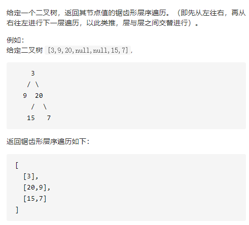

二叉树锯齿形层序遍历



详细思路

层序遍历，pop更新答案push，更新答案用isleft来reverse，固定大小for来进行一层一层

```c
class Solution {
public:
    vector<vector<int>> zigzagLevelOrder(TreeNode* root) {
        if(!root)return {};
        queue<TreeNode*>que;
        que.push(root);
        vector<vector<int>>ans;
        bool isLeft=true;
        while(!que.empty()){
            vector<int>ans1;
            int sz=que.size();
            for(int i=0;i<sz;i++){
                TreeNode*tmp=que.front();que.pop();
                ans1.push_back(tmp->val);
                if(tmp->left)que.push(tmp->left);
                if(tmp->right)que.push(tmp->right);
            }
            if(!isLeft)reverse(ans1.begin(),ans1.end());
            ans.push_back(ans1);
            isLeft=!isLeft;
        }
        return ans;
    }
};
```