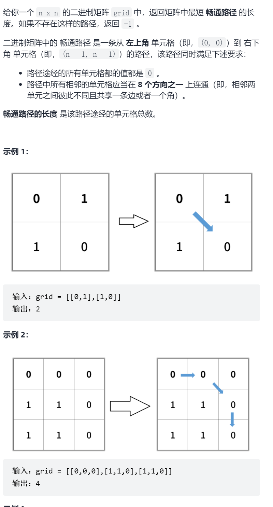
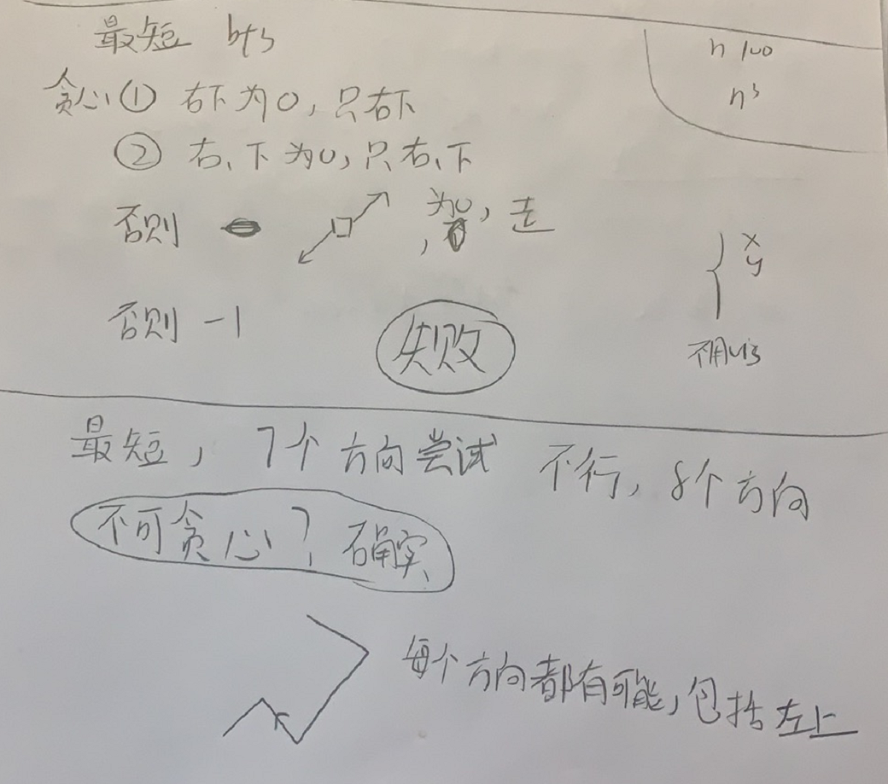

二进制矩阵中的最短路径

抽象图一二ij



```c
class Solution {
public:
    int xx[8]={-1,-1,-1,0,0,1,1,1},yy[8]={-1,0,1,-1,1,-1,0,1};
    int shortestPathBinaryMatrix(vector<vector<int>>& grid) {
        if(grid[0][0]==1)return -1;
        int n=grid.size();
        vector<vector<int>>vis(n,vector<int>(n));
        queue<pair<int,int>>que;
        que.push({0,0});
        vis[0][0]=1;
        int ans=1;
        while(!que.empty()){
            for(int sz=que.size();sz>0;sz--){
                auto [x,y]=que.front();que.pop();
                if(x==n-1&&y==n-1)return ans;
                for(int i=0;i<8;i++){
                    int dx=xx[i]+x,dy=yy[i]+y;
                    if(dx<0||dx>=n||dy<0||dy>=n||vis[dx][dy]==1||grid[dx][dy]==1)continue;
                    vis[dx][dy]=1;
                    que.push({dx,dy});
                }
            }
            ans++;
        }
        return -1;
    }
};
```

