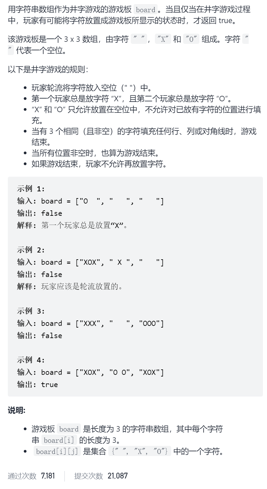
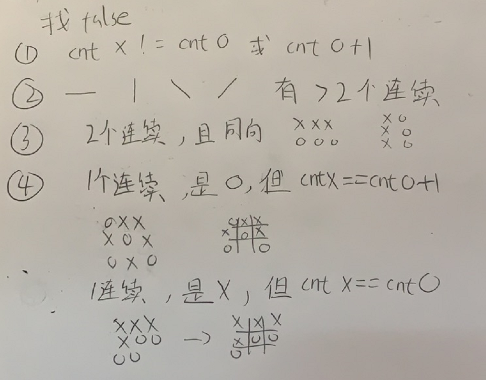

有效的井字游戏



抽象图一二ij



```c
class Solution {
public:
    bool validTicTacToe(vector<string>& board) {
        int cntX=0,cntO=0;
        for(int i=0;i<3;i++){
            for(int j=0;j<3;j++){
                if(board[i][j]=='X')cntX++;
                else if(board[i][j]=='O')cntO++;
            }
        }
        if(cntX!=cntO+1&&cntX!=cntO)return false;
        int cntThreeOk=0;
        int tmpCntX=0,tmpCntO=0;
        char four=' ';
        for(int i=0;i<3;i++){
            if(board[i][0]!=' '&&board[i][0]==board[i][1]&&board[i][0]==board[i][2]){
                if(board[i][0]=='X')tmpCntX++;
                else if(board[i][0]=='O')tmpCntO++;
                cntThreeOk++;
                four=board[i][0];
            }
        }
        if(tmpCntX==1&&tmpCntO==1)return false;
        tmpCntX=0,tmpCntO=0;
        for(int i=0;i<3;i++){
            if(board[0][i]!=' '&&board[0][i]==board[1][i]&&board[1][i]==board[2][i]){
                if(board[0][i]=='X')tmpCntX++;
                else if(board[0][i]=='O')tmpCntO++;
                cntThreeOk++;
                four=board[0][i];
            }  
        }
        if(tmpCntX==1&&tmpCntO==1)return false;
        if(board[0][0]!=' '&&board[0][0]==board[1][1]&&board[1][1]==board[2][2]){
            cntThreeOk++;
            four=board[0][0];
        }
        if(board[0][2]!=' '&&board[0][2]==board[1][1]&&board[1][1]==board[2][0]){
            cntThreeOk++;
            four=board[0][2];
        }
        if(cntThreeOk>2)return false;
        if(cntThreeOk==1&&four=='O'&&cntX==cntO+1)return false;
        if(cntThreeOk==1&&four=='X'&&cntX==cntO)return false;
        return true;
    }
};
```

