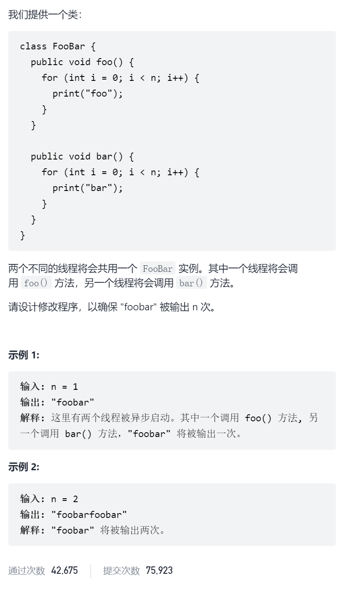

交替打印FooBar



抽象图一二ij

互斥锁

```c
class FooBar {
private:
    int n;
    mutex mtx1,mtx2;
public:
    FooBar(int n) {
        this->n = n;
        mtx2.lock();
    }
    void foo(function<void()> printFoo) {
        for (int i = 0; i < n; i++) {
            mtx1.lock();
            printFoo();
            mtx2.unlock();
        }
    }
    void bar(function<void()> printBar) {
        for (int i = 0; i < n; i++) {
            mtx2.lock();
            printBar();
            mtx1.unlock();
        }
    }
};
```

信号量

```c
#include<semaphore.h>
class FooBar {
private:
    int n;
    sem_t foo_done,bar_done;
public:
    FooBar(int n) {
        this->n = n;
        sem_init(&foo_done,0,0);
        sem_init(&bar_done,0,1);
    }
    void foo(function<void()> printFoo) {
        for (int i = 0; i < n; i++) {
            sem_wait(&bar_done);
            printFoo();
            sem_post(&foo_done);
        }
    }
    void bar(function<void()> printBar) {
        for (int i = 0; i < n; i++) {
            sem_wait(&foo_done);
            printBar();
            sem_post(&bar_done);
        }
    }
};
```

条件变量

```c
class FooBar {
private:
    int n;
    mutex mtx;
    condition_variable cv;
    bool foo_done=false;
public:
    FooBar(int n) {
        this->n = n;
    }
    void foo(function<void()> printFoo) {
        for (int i = 0; i < n; i++) {
            unique_lock<mutex>locker(mtx);
            cv.wait(locker,[&](){return foo_done==false;});
            printFoo();
            foo_done=true;
            cv.notify_one();
        }
    }
    void bar(function<void()> printBar) {
        for (int i = 0; i < n; i++) {
            unique_lock<mutex>locker(mtx);
            cv.wait(locker,[&](){return foo_done;});
            printBar();
            foo_done=false;
            cv.notify_one();
        }
    }
};
```

异步操作

```c
class FooBar {
private:
    int n;
    promise<void>readyFoo,readyBar;
    future<void>futureFoo,futureBar;
public:
    FooBar(int n) {
        this->n = n;
        futureFoo=readyFoo.get_future();
        futureBar=readyBar.get_future();
    }
    void foo(function<void()> printFoo) {   
        for (int i = 0; i < n; i++) {
            printFoo();
            readyFoo.set_value();
            futureBar.get();
            promise<void>newReadyBar;
            future<void>newFutureBar;
            readyBar=move(newReadyBar);
            newFutureBar=readyBar.get_future();
            futureBar=move(newFutureBar);
        }
    }
    void bar(function<void()> printBar) {   
        for (int i = 0; i < n; i++) {
            promise<void>newReadyFoo;
            future<void>newFutureFoo;
            readyFoo=move(newReadyFoo);
            newFutureFoo=readyFoo.get_future();
            futureFoo=move(newFutureFoo);
            printBar();
            readyBar.set_value();
        }
    }
};
```

原子操作

```c
class FooBar {
private:
    int n;
    atomic<bool>foo_done=false;
public:
    FooBar(int n) {
        this->n = n;
    }
    void foo(function<void()> printFoo) {
        for (int i = 0; i < n; i++) {
            while(foo_done){
                this_thread::yield();
            }            
            printFoo();
            foo_done=true;
        }
    }
    void bar(function<void()> printBar) {
        for (int i = 0; i < n; i++) {
            while(foo_done==false){
                this_thread::yield();
            }            
            printBar();
            foo_done=false;
        }
    }
};
```

