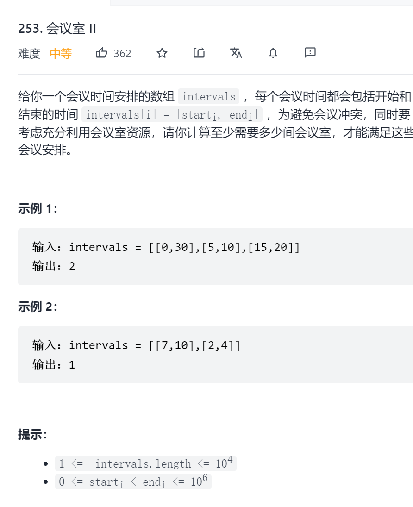

思路

这个问题与公司员工每天可能面临的问题很相似。

假设你在一家公司的 IT 部门工作，你的工作职责之一是为办公室全天举行的会议提供会议室。

办公室有多个会议室,你希望能合理地使用它们。不让人们等待，给每组员工一个按时开会的空间。

另一方面，除非必要，你也不想占用过多会议室。如果会议互相冲突，在不同会议室安排会议；否则的话，就尽量少使用会议室。你该怎么做？

刚刚提出的是办公室中一个常见的场景，在一天天中，给定了每个会议开始和结束的时间，你需要给不同的团队安排会议室。

让我们换个角度，从一组想要开会但还没有分配会议室的人员的角度来看这个问题。他们会怎么做？

这组人会依次查看会议室，检查是否有任何会议室是空闲的。如果他们找到一间空闲的会议室，就会在那个房间里开始开会。否则,他们会等待一个会议室空出来。一旦会议室空出来,他们就会占用它。

这就是我们将遵循的基本方法。可以说（但不确切），这是一个模拟的过程。在最坏的情况下，我们可以为每个会议分配一个新房间，但这显然不是最优的，除非它们相互冲突。

我们需要高效地判断当前会议是否有房间可用，并只在分配的房间目前没有空闲时才分配新房间。

来看看基于上述讨论的方法一。

方法一：优先队列
我们无法按任意顺序处理给定的会议。处理会议的最基本方式是按其 开始时间 顺序排序，这也是我们采取的顺序。这就是我们将遵循的顺序。毕竟，在担心下午5：00的会议之前，你肯定应该先安排上午9：00的会议，不是吗？

让我们对一个示例问题进行一次模拟，来分析我们的算法应该能有效地执行哪些操作。

考虑下面的会议时间 (1, 10), (2, 7), (3, 19), (8, 12), (10, 20), (11, 30) 。前一部分表示会议开始时间，后一部分表示结束时间。按照会议开始时间顺序考虑。图一展示了前三个会议，每个会议都由于冲突而需要新房间。


后面的三个会议开始占用现有的房间。然而，最后的会议需要一个新房间。总而言之，我们需要四个房间来容纳所有会议。


排序过程很容易，但对每个会议，我们如何高效地找出是否有房间可用？任意时刻，我们都有多个可能占用的房间，只要我们能在有新会议需要时就找到一个空闲房间，我们并不需要关心到底有哪些房间是空闲的。

一个朴素的方法是，每当有新会议时，就遍历所有房间，查看是否有空闲房间。

但是,通过使用优先队列（或最小堆）堆数据结构,我们可以做得更好。

我们可以将所有房间保存在最小堆中,堆中的键值是会议的结束时间，而不用手动迭代已分配的每个房间并检查房间是否可用。

这样，每当我们想要检查有没有 任何 房间是空的，只需要检查最小堆堆顶的元素，它是最先开完会腾出房间的。

如果堆顶的元素的房间并不空闲，那么其他所有房间都不空闲。这样，我们就可以直接开一个新房间。

在进入程序实现之前，先来看一遍算法的流程。

算法

按照 开始时间 对会议进行排序。

初始化一个新的 最小堆，将第一个会议的结束时间加入到堆中。我们只需要记录会议的结束时间，告诉我们什么时候房间会空。

对每个会议，检查堆的最小元素（即堆顶部的房间）是否空闲。

若房间空闲，则从堆顶拿出该元素，将其改为我们处理的会议的结束时间，加回到堆中。
若房间不空闲。开新房间，并加入到堆中。
处理完所有会议后，堆的大小即为开的房间数量。这就是容纳这些会议需要的最小房间数。

让我们尽量不要看下面的答案。

JavaPython

```c
class Solution {
    public int minMeetingRooms(int[][] intervals) {

    // Check for the base case. If there are no intervals, return 0
    if (intervals.length == 0) {
      return 0;
    }
    
    // Min heap
    PriorityQueue<Integer> allocator =
        new PriorityQueue<Integer>(
            intervals.length,
            new Comparator<Integer>() {
              public int compare(Integer a, Integer b) {
                return a - b;
              }
            });
    
    // Sort the intervals by start time
    Arrays.sort(
        intervals,
        new Comparator<int[]>() {
          public int compare(final int[] a, final int[] b) {
            return a[0] - b[0];
          }
        });
    
    // Add the first meeting
    allocator.add(intervals[0][1]);
    
    // Iterate over remaining intervals
    for (int i = 1; i < intervals.length; i++) {
    
      // If the room due to free up the earliest is free, assign that room to this meeting.
      if (intervals[i][0] >= allocator.peek()) {
        allocator.poll();
      }
    
      // If a new room is to be assigned, then also we add to the heap,
      // If an old room is allocated, then also we have to add to the heap with updated end time.
      allocator.add(intervals[i][1]);
    }
    
    // The size of the heap tells us the minimum rooms required for all the meetings.
    return allocator.size();

  }
}
```

复杂度分析

时间复杂度：O(N\log N)O(NlogN) 。

时间开销主要有两部分。第一部分是数组的 排序 过程，消耗 O(N\log N)O(NlogN) 的时间。数组中有 NN 个元素。
接下来是 最小堆 占用的时间。在最坏的情况下，全部 NN 个会议都会互相冲突。在任何情况下，我们都要向堆执行 NN 次插入操作。在最坏的情况下，我们要对堆进行 NN 次查找并删除最小值操作。总的时间复杂度为 (NlogN)(NlogN) ，因为查找并删除最小值操作只消耗 O(\log N)O(logN) 的时间。
空间复杂度：O(N)O(N) 。额外空间用于建立 最小堆 。在最坏的情况下，堆需要容纳全部 NN 个元素。因此空间复杂度为 O(N)O(N) 。

方法二：有序化
思路

提供给我们的会议时间可以确定一天中所有事件的时间顺序。我们拿到了每个会议的开始和结束时间，这有助于我们定义此顺序。

根据会议的开始时间来安排会议有助于我们了解这些会议的自然顺序。然而，仅仅知道会议的开始时间，还不足以告诉我们会议的持续时间。我们还需要按照结束时间排序会议，因为一个“会议结束”事件告诉我们必然有对应的“会议开始”事件，更重要的是，“会议结束”事件可以告诉我们，一个之前被占用的会议室现在空闲了。

一个会议由其开始和结束时间定义。然而，在本算法中，我们需要 分别 处理开始时间和结束时间。这乍一听可能不太合理，毕竟开始和结束时间都是会议的一部分，如果我们将两个属性分离并分别处理，会议自身的身份就消失了。但是，这样做其实是可取的，因为：

当我们遇到“会议结束”事件时，意味着一些较早开始的会议已经结束。我们并不关心到底是哪个会议结束。我们所需要的只是 一些 会议结束,从而提供一个空房间。

考虑上一方法中使用的案例。 要考虑的会议为：(1, 10), (2, 7), (3, 19), (8, 12), (10, 20), (11, 30) 。像之前那样，第一张图说明前三个会议彼此冲突，需要分别分配房间。


后两张图处理剩下的会议，可以看到，我们可以复用一些已有的会议室。最终的结果是相同的，我们一共需要4个会议室，这是最优的结果。


算法

分别将开始时间和结束时间存进两个数组。
分别对开始时间和结束时间进行排序。请注意，这将打乱开始时间和结束时间的原始对应关系。它们将被分别处理。
考虑两个指针：s_ptr 和 e_ptr ，分别代表开始指针和结束指针。开始指针遍历每个会议，结束指针帮助我们跟踪会议是否结束。
当考虑 s_ptr 指向的特定会议时，检查该开始时间是否大于 e_ptr 指向的会议。若如此，则说明 s_ptr 开始时，已经有会议结束。于是我们可以重用房间。否则，我们就需要开新房间。
若有会议结束，换而言之，start[s_ptr] >= end[e_ptr] ，则自增 e_ptr 。
重复这一过程，直到 s_ptr 处理完所有会议。
让我们尽量不要看下面的答案。

JavaPython

```c
class Solution {
    public int minMeetingRooms(int[][] intervals) {

    // Check for the base case. If there are no intervals, return 0
    if (intervals.length == 0) {
      return 0;
    }
    
    Integer[] start = new Integer[intervals.length];
    Integer[] end = new Integer[intervals.length];
    
    for (int i = 0; i < intervals.length; i++) {
      start[i] = intervals[i][0];
      end[i] = intervals[i][1];
    }
    
    // Sort the intervals by end time
    Arrays.sort(
        end,
        new Comparator<Integer>() {
          public int compare(Integer a, Integer b) {
            return a - b;
          }
        });
    
    // Sort the intervals by start time
    Arrays.sort(
        start,
        new Comparator<Integer>() {
          public int compare(Integer a, Integer b) {
            return a - b;
          }
        });
    
    // The two pointers in the algorithm: e_ptr and s_ptr.
    int startPointer = 0, endPointer = 0;
    
    // Variables to keep track of maximum number of rooms used.
    int usedRooms = 0;
    
    // Iterate over intervals.
    while (startPointer < intervals.length) {
    
      // If there is a meeting that has ended by the time the meeting at `start_pointer` starts
      if (start[startPointer] >= end[endPointer]) {
        usedRooms -= 1;
        endPointer += 1;
      }
    
      // We do this irrespective of whether a room frees up or not.
      // If a room got free, then this used_rooms += 1 wouldn't have any effect. used_rooms would
      // remain the same in that case. If no room was free, then this would increase used_rooms
      usedRooms += 1;
      startPointer += 1;
    
    }
    
    return usedRooms;

  }
}
```

复杂度分析

时间复杂度: O(N\log N)O(NlogN) 。我们所做的只是将 开始时间 和 结束时间 两个数组分别进行排序。每个数组有 NN 个元素，因为有 NN 个时间间隔。

空间复杂度: O(N)O(N) 。我们建立了两个 NN 大小的数组。分别用于记录会议的开始时间和结束时间。

