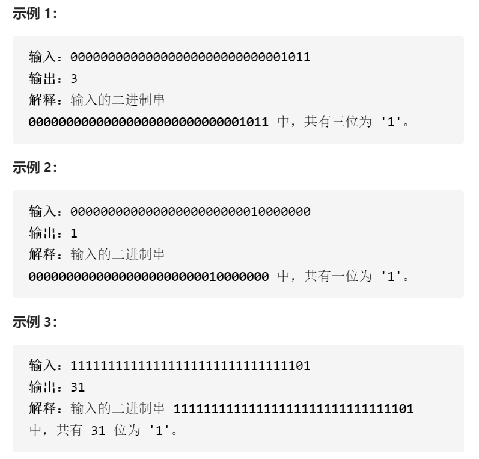

位1的个数



变量简洁正确完整定义

32次，每次取最低位&1更新答案然后》》1

```c
class Solution {
public:
    int hammingWeight(uint32_t n) {
        int ans=0;
        for(int i=0;i<32;i++){
            if((n&1)==1)ans++;
            n>>=1;
        }
        return ans;
    }
};
```


踩过的坑

&运算优先级低于+-和》》《《

变量简洁正确完整思路

只要n不是0，n&（n-1）可以将最低位1变为0，每次&，ans++，知道==0，有多少1

计算多少次

```c
class Solution {
public:
    int hammingWeight(uint32_t n) {
        int ans=0;
        while(n)n&=n-1,ans++;
        return ans;
    }
};
```

