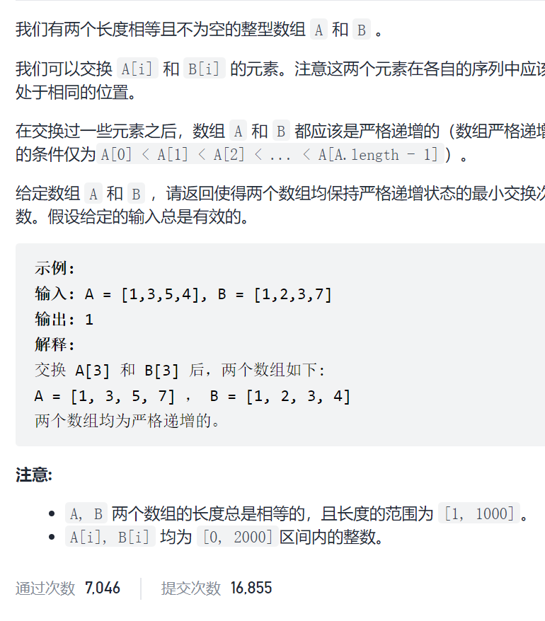
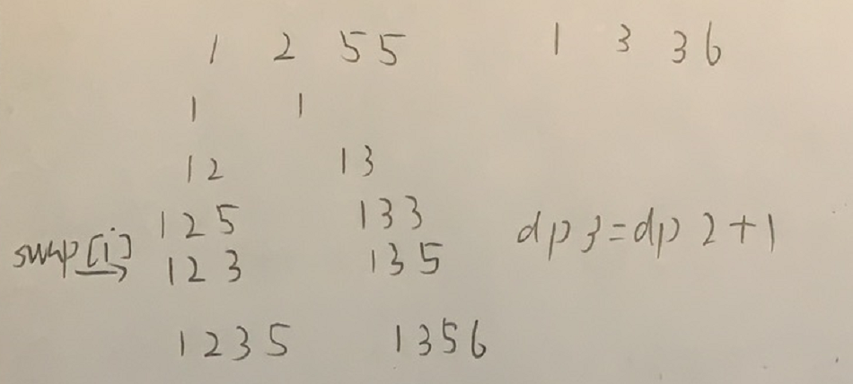
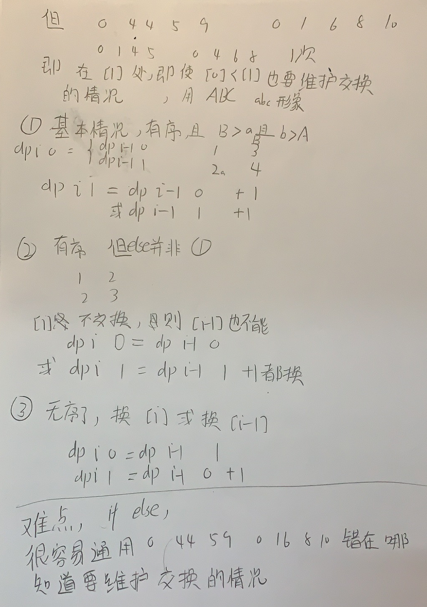

使序列递增的最小交换次数



抽象图一二ij



```c
class Solution {
public:
    int minSwap(vector<int>& nums1, vector<int>& nums2) {
        int n=nums1.size();
        vector<vector<int>>dp(n,vector<int>(2,0));
        dp[0][0]=0;
        dp[0][1]=1;
        for(int i=1;i<n;i++){
            if(nums1[i]>nums1[i-1]&&nums2[i]>nums2[i-1]){
                if(nums1[i]>nums2[i-1]&&nums2[i]>nums1[i-1]){
                    dp[i][1]=min(dp[i-1][0],dp[i-1][1])+1;
                    dp[i][0]=min(dp[i-1][0],dp[i-1][1]);
                }else {
                    dp[i][0]=dp[i-1][0];
                    dp[i][1]=dp[i-1][1]+1;
                }
            }else { 
                dp[i][0]=dp[i-1][1];
                dp[i][1]=dp[i-1][0]+1;
            }
        }
        return min(dp[n-1][0],dp[n-1][1]);
    }
};
```

