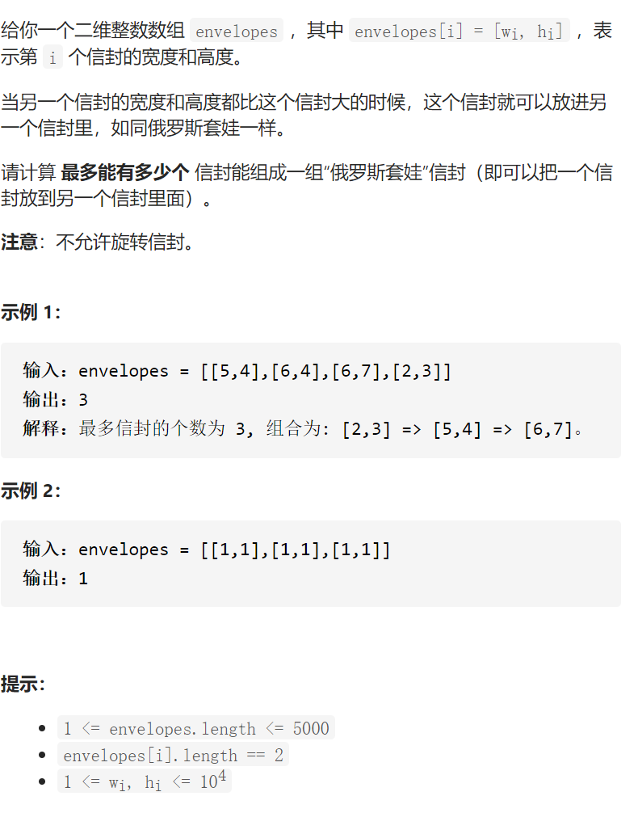

俄罗斯套娃信封问题



《最长递增子序列》

变量简洁正确完整思路

w递增的情况之下，从h中找到一个最长的严格递增子序列，w如果相同如 11 12

h不能选12，解决方法是如果w相同则h降序，这样就 12 11 w相同的h不可能严格递增，之后只需要考虑h就行了，最长严格递增子序列

dpi numi为结尾的最长严格递增长度，dp0是第一个

10 9 2 5 3 7 101 18

dp i=max(dpj +1)dp i  if  numj<numi

初始化 dp i=1

```c
class Solution {
public:
    int maxEnvelopes(vector<vector<int>>& envelopes) {
        sort(envelopes.begin(),envelopes.end(),[](auto &lhs,auto &rhs){
            return lhs[0]<rhs[0]||lhs[0]==rhs[0]&&lhs[1]>=rhs[1];
        });
        int n=envelopes.size();
        vector<int>dp(n,1);
        int ans=1;
        for(int i=1;i<n;i++){
            for(int j=0;j<i;j++){
                if(envelopes[j][1]<envelopes[i][1]){
                    dp[i]=max(dp[i],dp[j]+1);
                    ans=max(ans,dp[i]);
                }
            }
        }
        return ans;
    }
};
```


变量简洁正确完整思路

定义严格递增序列up，序列的长度就是答案，对于num，如果大于up.back，uppush_back

否则，不可能变长，但是可以贪心一下，找到upi大于num，用num取代，这样就可以让

整体上结尾更小，upi是第一个大于num的upi，用二分查找，[mid]》num左边找right=mid

[mid]《num右边找left=mid+1，==break，


```c
class Solution {
public:
    int maxEnvelopes(vector<vector<int>>& envelopes) {
        sort(envelopes.begin(),envelopes.end(),[](auto &lhs,auto &rhs){
            return lhs[0]<rhs[0]||lhs[0]==rhs[0]&&lhs[1]>=rhs[1];
        });
        int n=envelopes.size();
        vector<int>up;
        up.push_back(envelopes[0][1]);
        for(int i=1;i<n;i++){
            if(envelopes[i][1]>up.back()){
                up.push_back(envelopes[i][1]);
            }else {
                int left=0,right=up.size()-1;
                while(1){
                    int mid=left+(right-left)/2;
                    if(left==mid){
                        if(up[left]>=envelopes[i][1]){
                            up[left]=envelopes[i][1];
                        }else if(up[right]>=envelopes[i][1]){
                            up[right]=envelopes[i][1];
                        }
                        break;
                    }
                    if(up[mid]>=envelopes[i][1])right=mid;
                    else if(up[mid]<envelopes[i][1])left=mid+1;
                }
            }
        }
        return up.size();
    }
};
```

踩过的坑

up长度不变的更新时，前面还不能小于，所以干脆找第一个大于等于的upi替换

