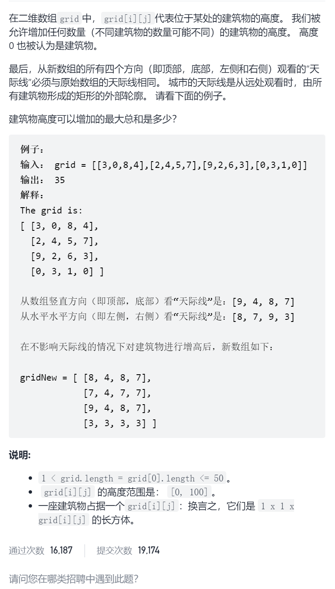

保持城市天际线

```c
class Solution {
public:
    int maxIncreaseKeepingSkyline(vector<vector<int>>& grid) {
        int n=grid.size(),m=grid[0].size();
        vector<int>rowMax(n,0);
        for(int i=0;i<n;i++){
            int maxNum=0;
            for(int j=0;j<m;j++){
                maxNum=max(maxNum,grid[i][j]);
            }
            rowMax[i]=maxNum;
        }
        vector<int>colMax(m,0);
        for(int i=0;i<m;i++){
            int maxNum=0;
            for(int j=0;j<n;j++){
                maxNum=max(maxNum,grid[j][i]);
            }
            colMax[i]=maxNum;
        }
        int ans=0;
        for(int i=0;i<n;i++){
            for(int j=0;j<m;j++){
                int maxHigh=min(rowMax[i],colMax[j]);
                int need=maxHigh-grid[i][j];
                if(need>0)ans+=need;
            }
        }
        return ans;
    }
};
```


