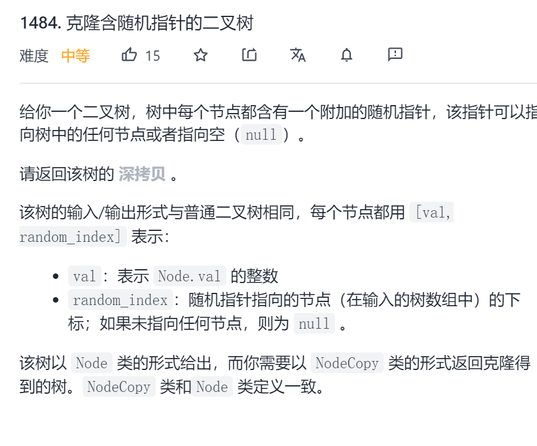

两次的层序遍历：
第一次遍历，构造普通节点，将节点对应关系存储进map中
第二次遍历，构造随机指针，直接读取map


```c
public NodeCopy copyRandomBinaryTree(Node root) {
    if (root == null) {
        return null;
    }
    Map<Node, NodeCopy> map = new HashMap<>();

    Queue<Node> queue = new LinkedList<>();
    queue.offer(root);

    NodeCopy rootCpoy = new NodeCopy(root.val);
    Queue<NodeCopy> copyQueue = new LinkedList<>();
    copyQueue.offer(rootCpoy);
    map.put(root, rootCpoy);

    while (!queue.isEmpty()) {
        Node node = queue.poll();
        NodeCopy nodeCopy = copyQueue.poll();

        if (node.left != null) {
            queue.offer(node.left);
            NodeCopy leftCopy = new NodeCopy(node.left.val);
            nodeCopy.left = leftCopy;
            copyQueue.offer(leftCopy);
            map.put(node.left, leftCopy);
        }
        if (node.right != null) {
            queue.offer(node.right);
            NodeCopy rightCopy = new NodeCopy(node.right.val);
            nodeCopy.right = rightCopy;
            copyQueue.offer(rightCopy);
            map.put(node.right, rightCopy);
        }
    }

    queue.offer(root);
    copyQueue.offer(rootCpoy);
    while (!queue.isEmpty()) {
        Node node = queue.poll();
        NodeCopy nodeCopy = copyQueue.poll();
        nodeCopy.random = map.get(node.random);

        if (node.left != null) {
            queue.offer(node.left);
            copyQueue.offer(nodeCopy.left);
        }
        if (node.right != null) {
            queue.offer(node.right);
            copyQueue.offer(nodeCopy.right);
        }
    }

    return rootCpoy;
}
```
一次的层序遍历：

```c
Map<Node, NodeCopy> map = new HashMap<>();

public NodeCopy copyRandomBinaryTree(Node root) {
    if (root == null) {
        return null;
    }

    Queue<Node> queue = new LinkedList<>();
    queue.offer(root);

    NodeCopy rootCpoy = new NodeCopy(root.val);
    Queue<NodeCopy> copyQueue = new LinkedList<>();
    copyQueue.offer(rootCpoy);
    map.put(root, rootCpoy);

    while (!queue.isEmpty()) {
        Node node = queue.poll();
        NodeCopy nodeCopy = copyQueue.poll();
        nodeCopy.random = get(node.random);
        if (node.left != null) {
            queue.offer(node.left);
            NodeCopy nodeCopyLeft = get(node.left);
            nodeCopy.left = nodeCopyLeft;
            copyQueue.offer(nodeCopyLeft);
            map.put(node.left, nodeCopyLeft);
        }
        if (node.right != null) {
            queue.offer(node.right);
            NodeCopy nodeCopyRight = get(node.right);
            nodeCopy.right = nodeCopyRight;
            copyQueue.offer(nodeCopyRight);
            map.put(node.right, nodeCopyRight);
        }
    }

    return rootCpoy;
}

private NodeCopy get(Node node) {
    if (node == null) {
        return null;
    }
    if (map.containsKey(node)) {
        return map.get(node);
    }
    NodeCopy nodeCopy = new NodeCopy(node.val);
    map.put(node, nodeCopy);
    return nodeCopy;
}
```

