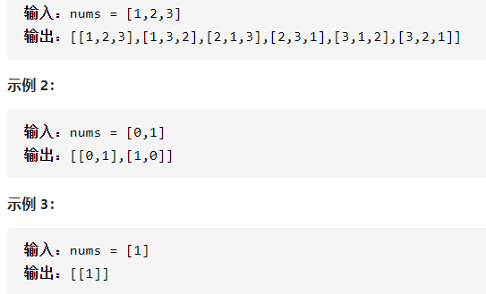

全排列



详细思路

dfs，每次枚举每个数，每次取一个放到ans1，或者不要，保存深度，vis防止取同一个数

精确定义

depth需要处理第几个元素，深度

```c
class Solution {
public:
    vector<vector<int>>ans;
    vector<vector<int>> permute(vector<int>& nums) {
        vector<int>ans1;
        vector<int>vis(nums.size());
        dfs(nums,ans1,vis,0);
        return ans;
    }
    void dfs(vector<int>&nums,vector<int>&ans1,vector<int>&vis,int depth){
        if(depth==nums.size()){
            ans.push_back(ans1);
            return ;
        }
        for(int i=0;i<nums.size();i++){
            if(vis[i])continue;
            ans1.push_back(nums[i]);
            vis[i]=1;
            dfs(nums,ans1,vis,depth+1);
            vis[i]=0;
            ans1.pop_back();
        }
    }
};
```

