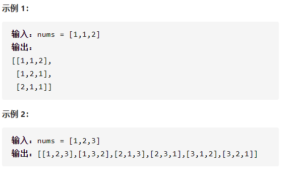

全排列II



详细思路

dfs，深度==放进ans并返回，枚举数字，放进ans1，或者不要，vis防止重复拿一个元素，排序后nums[i]==nums[i-1]continue防止只是交换

精确定义

depth需要判断第几个数字

```c
class Solution {
public:
    vector<vector<int>>ans;
    vector<vector<int>> permuteUnique(vector<int>& nums) {
        if(nums.size()==0)return ans;
        vector<int>ans1;
        vector<int>vis(nums.size());
        sort(nums.begin(),nums.end());
        dfs(nums,ans1,vis,0);
        return ans;
    }
    void dfs(vector<int>&nums,vector<int>&ans1,vector<int>&vis,int depth){
        if(depth==nums.size()){
            ans.push_back(ans1);
            return;
        }
        for(int i=0;i<nums.size();i++){
            if(vis[i])continue;
            if(i-1>=0&&!vis[i-1]&&nums[i]==nums[i-1])continue;
            ans1.push_back(nums[i]);
            vis[i]=1;
            dfs(nums,ans1,vis,depth+1);
            vis[i]=0;
            ans1.pop_back();
        }
    }
};
```

踩过的坑

​      if(i-1>=0&&!vis[i-1]&&nums[i]==nums[i-1])continue;

如果！vis[i-1]说明是新的开始而且只是交换