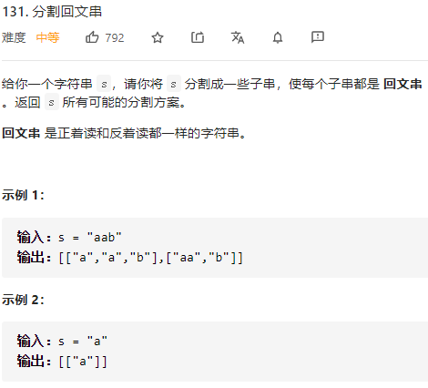

分割回文串



详细思路

因为需要找到所有的子串，一般dfs，dfs找到每一个子串，形参i为子串起点，枚举终点，如果子串是回文串就更新答案，或者不要这个子串，判断子串是否为回文串用动态规划dpij，i起点j终点

精确定义

dpij i到j是否为回文串，dpii是长度为1的字符串，dpi i-1是空字符串

i需要判断的起点

j需要判断的终点

转移

\- - a a - dp i j=dp i+1 j-1

\- - a b - dp i j =false

初始化

dp ii 1    dp i i-1 1  

```c
class Solution {
public:
    vector<vector<string>> partition(string s) {
        int n=s.size();
        vector<vector<int>>dp(n,vector<int>(n,0));
        for(int i=1;i<n;i++)dp[i][i]=dp[i][i-1]=1;
        dp[0][0]=1;
        for(int len=2;len<=n;len++){
            for(int i=0;i+len-1<n;i++){
                int j=i+len-1;
                if(s[i]==s[j])dp[i][j]=dp[i+1][j-1];
            }
        }
        vector<vector<string>>ans;
        vector<string>ans1;
        dfs(0,s,dp,ans,ans1);
        return ans;
    }
    void dfs(int i,string &s,vector<vector<int>>&dp,vector<vector<string>>&ans,vector<string>&ans1){
        if(i==s.size()){
            ans.push_back(ans1);
            return;
        }
        for(int j=i;j<s.size();j++){
            if(dp[i][j]){
                string tmp=s.substr(i,j-i+1);
                ans1.push_back(tmp);
                dfs(j+1,s,dp,ans,ans1);
                ans1.pop_back();
            }
        }
    }
};

```

踩过的坑

如果dp枚举起点终点，会出错，dp14=dp23,但是子问题23还没弄好，必须枚举长度，枚举起点，这样就是中心扩展的，不会出现子问题还没有解决

枚举子串常用回溯参数起点和枚举终点

