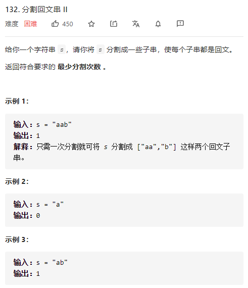

分割回文串II

详细思路

具有某种递推关系

精确定义

fi 0到i最少分割次数，只需要往前面找fj，j到i是回文串，则fi=fj+1，f0是第一个字符

i下标，最后一个

j下标，最后一个，j+1到i是否为回文

转移

\- - - - a b a

f i =f j+1 如果s[j+1，i]回文串

初始化

f 0=0本身是回文串分割次数0

判断s[j+1,i]是否为回文串用动态规划g

精确定义

g i j i第一j最后是否回文，ij是下标

转移

\- - a b a 

g ij =g i+1 j-1   相同

初始化

g i i=g i i-1 =1 

遍历方法

for len for i起点

```c
class Solution {
public:
    int minCut(string s) {
        int n=s.size();
        vector<vector<int>>g(n,vector<int>(n,0));
        g[0][0]=1;
        for(int i=1;i<n;i++)g[i][i]=g[i][i-1]=1;
        for(int len=2;len<=n;len++){
            for(int i=0;i+len-1<n;i++){
                int j=i+len-1;
                if(s[i]==s[j])g[i][j]=g[i+1][j-1];
            }
        }
        vector<int>f(n,0x3f3f3f3f);
        f[0]=0;
        for(int i=1;i<n;i++){
            if(g[0][i])f[i]=0;
            else {
                for(int j=0;j<i;j++){
                    if(g[j+1][i])f[i]=min(f[i],f[j]+1);
                }
            }

        }
        return f[n-1];
    }
};
```


踩过的坑

​      if(g[0][i])f[i]=0;

是回文串，则不应该去找fj切割

​    if(g[j+1][i])f[i]=min(f[i],f[j]+1);

应该找一个切割次数最小的fj

