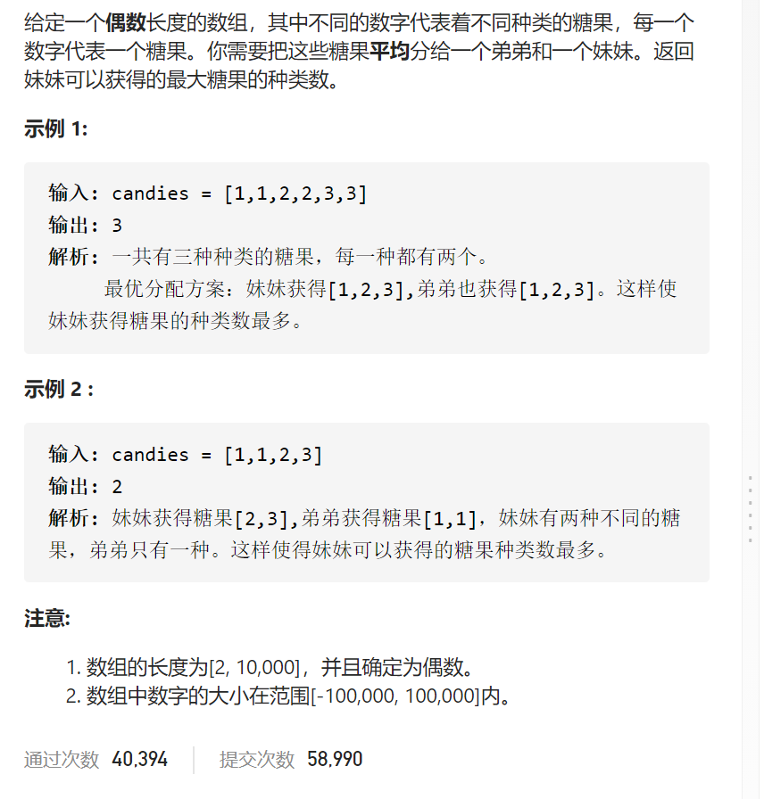
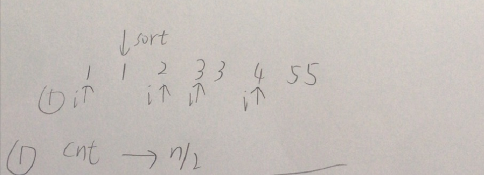
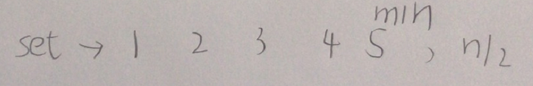

分糖果



抽象图一二ij



```c
class Solution {
public:
    int distributeCandies(vector<int>& candyType) {
        int n=candyType.size();
        sort(candyType.begin(),candyType.end());
        int cnt=0;
        for(int i=0;i<n;i++){
            if(i==0||candyType[i]>candyType[i-1]){
                cnt++;
                if(cnt==n/2)break;
            }
        }
        return cnt;
    }
};
```




```c

class Solution {
public:
    int distributeCandies(vector<int>& candyType) {
        set<int>type;
        int n=candyType.size();
        for(int i=0;i<n;i++)type.insert(candyType[i]);
        return min((int)type.size(),n/2);
    }
};
```

