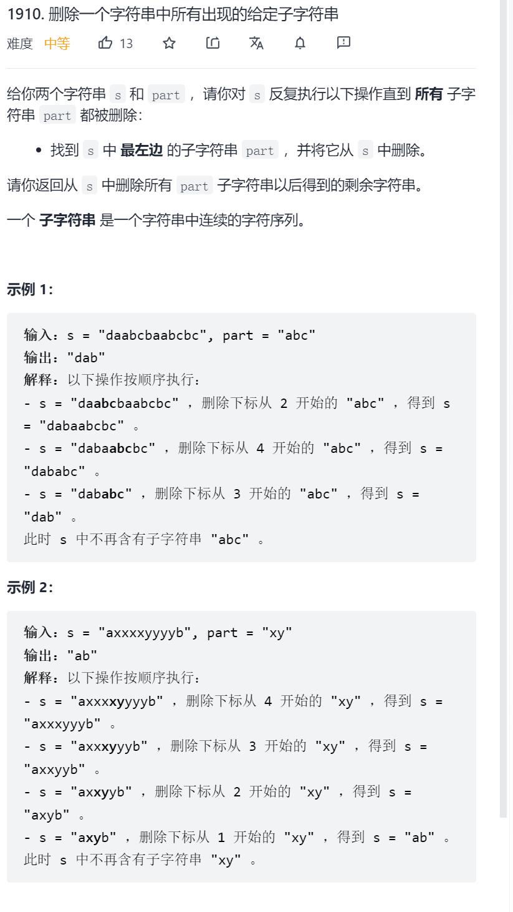

方法二：\text{KMP}KMP 算法
思路与算法

在方法一中，每一次匹配都需要暴力比较两个长度为 mm 的字符串，时间复杂度为 O(m)O(m)。我们可以对暴力比较的过程进行优化。在这里，我们使用 \text{KMP}KMP 算法对匹配过程进行优化。如果读者不熟悉 \text{KMP}KMP 算法，可以阅读「28. 实现 strStr() 的官方题解」 中的方法二。

在这里，除了需要保留 \textit{part}part 的前缀函数数组，我们还需要保留 \textit{res}res 的前缀函数数组。当新插入字符对应的前缀函数值等于 mm 时，代表 \textit{res}res 中长度为 mm 的后缀与 \textit{part}part 相等，此时我们需要删去该后缀以及对应的前缀函数值。

另外，由于 \texttt{Python}Python 等语言不支持删除字符串的元素，我们需要将字符串转化为数组进行操作。

代码

```c
class Solution {
public:
    string removeOccurrences(string s, string part) {
        int m = part.size();
        vector<int> pi1(m);   // part 的前缀数组
        // 更新 part 的前缀数组
        for (int i = 1, j = 0; i < m; i++) {
            while (j > 0 && part[i] != part[j]) {
                j = pi1[j-1];
            }
            if (part[i] == part[j]) {
                j++;
            }
            pi1[i] = j;
        }

        string res;
        vector<int> pi2 = {0};   // res 的前缀数组
        for (const char ch: s) {
            // 模拟从左至右匹配的过程
            res.push_back(ch);
            // 更新 res 的前缀数组
            int j = pi2.back();
            while (j > 0 && ch != part[j]) {
                j = pi1[j-1];
            }
            if (ch == part[j]){
                ++j;
            }
            pi2.push_back(j);
            if (j == m) {
                // 如果匹配成功，那么删去对应后缀
                pi2.erase(pi2.end() - m, pi2.end());
                res.erase(res.end() - m, res.end());
            }
        }
        return res;
    }
};


```

复杂度分析

时间复杂度：O(n + m)O(n+m)，其中 nn 为字符串 ss 的长度，mm 为字符串 \textit{part}part 的长度。计算 ss 与 \textit{res}res 的前缀数组的时间复杂度为 O(n + m)O(n+m)；由于 ss 中的每个字符最多会被加入或删除各一次，因此维护 \textit{res}res 的时间复杂度为 O(n)O(n)。

空间复杂度：O(n + m)O(n+m)。

