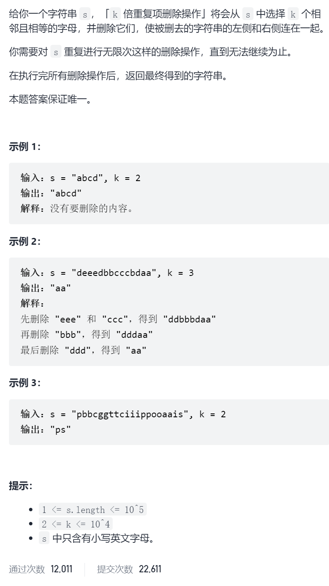
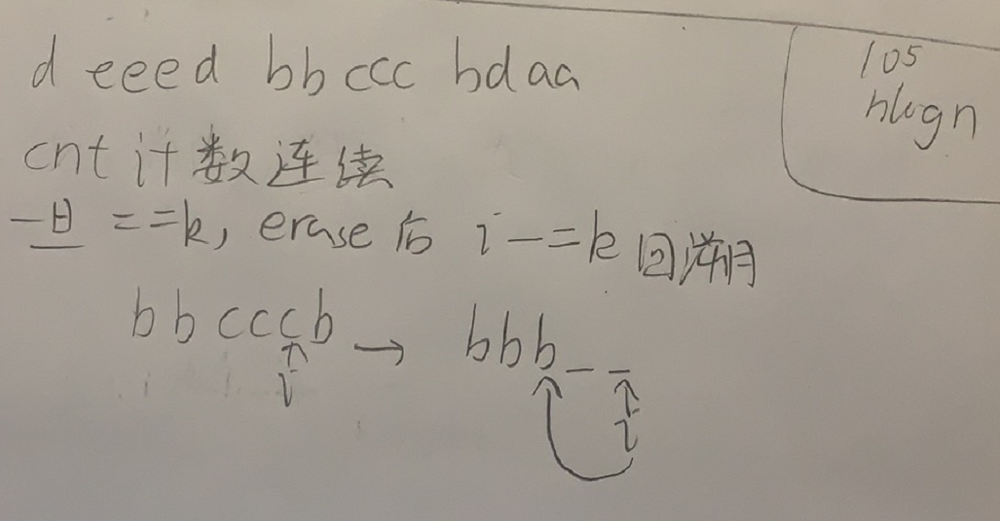

删除字符串中的所有相邻重复项II

抽象图一二ij



```c
class Solution {
public:
    string removeDuplicates(string s, int k) {
        int cnt[100005];
        memset(cnt,0,sizeof(cnt));
        cnt[0]=1;
        for(int i=1;i<s.size();i++){
            if(s[i]!=s[i-1])cnt[i]=1;
            else {
                cnt[i]=cnt[i-1]+1;
                if(cnt[i]==k){
                    s.erase(i-k+1,k);
                    i-=k;
                    if(i<0)i=0;
                }
            }
        }
        return s;
    }
};
```

