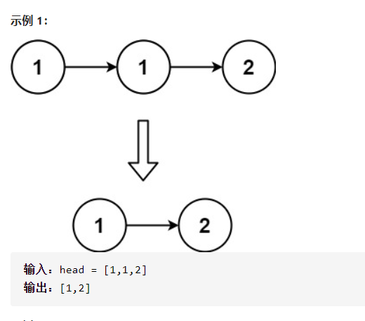
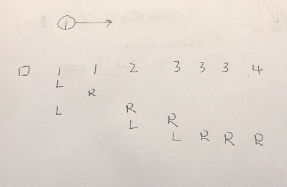
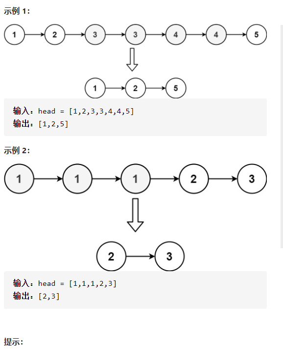
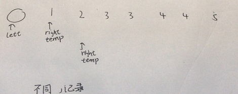

删除排序链表中的重复元素



详细思路

leftright，left是已经好了，right是需要判断，相等right++，不相等left连上去，++ ++；

画图



```c

class Solution {
public:
    ListNode* deleteDuplicates(ListNode* head) {
        if(!head||!head->next)return head;
        ListNode*left=head;
        ListNode*right=left->next;
        while(right){
            while(right->next&&right->val==left->val)right=right->next;
            if(!right->next){
                if(right->val==left->val){
                    left->next=nullptr;
                    return head;
                }
                else{
                    left->next=right;
                    return head;
                }
            }
            if(right){
                left->next=right;
                left=right;
                right=right->next;
            }
        }
        return head;
    }
};
```


踩过的坑

链表题代码不重要，必须画图，最重要的是处理好如何结束，就是找到一个地方插入if return else return

​      if(!right->next){

​        if(right->val==left->val){

​          left->next=nullptr;

​          return head;

​        }

​        else{

​          left->next=right;

​          return head;

​        }

​      }


------

删除排序链表中的重复元素II



详细思路

leftright，left是已经好了，right是需要判断，如果right记录数字，下一步遇到不同的就说明原来right是好的，如果相同就一直向前直到

画图



精确定义

left

right

temp

```c
class Solution {
public:
    ListNode* deleteDuplicates(ListNode* head) {
        if(!head)return head;
        ListNode*dummy=new ListNode(-1,head);
        ListNode*left=dummy,*right=head,*temp=head;
        while(right->next){
            right=right->next;
            if(temp->val!=right->val){
                left->next=temp;
                left=left->next;
                temp=right;
            }
            else {
                while(right->next&&temp->val==right->val)right=right->next;
                if(!right->next&&temp->val==right->val)left->next=nullptr;
                else if(!right->next&&temp->val!=right->val)left->next=right;
                temp=right;

            }
        }
        return dummy->next;
    }
};

```

踩过的坑

​       if(!right->next&&temp->val==right->val)left->next=nullptr;

​        else if(!right->next&&temp->val!=right->va

如果没有这句话，是不会把最后的那些right考虑进去的，要考虑right到最后需不需要更新left

必须画图，画图找变量