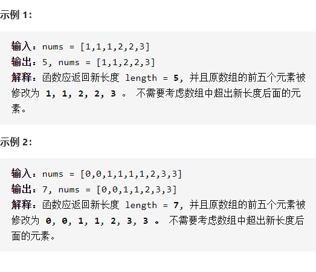
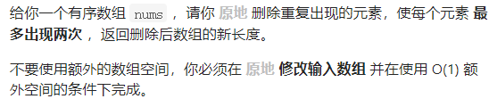

删除有序数组中的重复项II

详细思路

双指针，left是已经弄好的，right去探索，只要left左边不会和right相同，就可以left++并保存，right++去探索

精确定义

left已经

right需要

```c
class Solution {
public:
    int removeDuplicates(vector<int>& nums) {
        int n=nums.size();
        if(n<3)return n;
        int left=1,right=2;
        while(right<n){
            if(nums[right]==nums[left-1]){
                right++;
                continue;
            }
            left++;
            nums[left]=nums[right];
            right++;
        }
        return left+1;
    }
};
```

