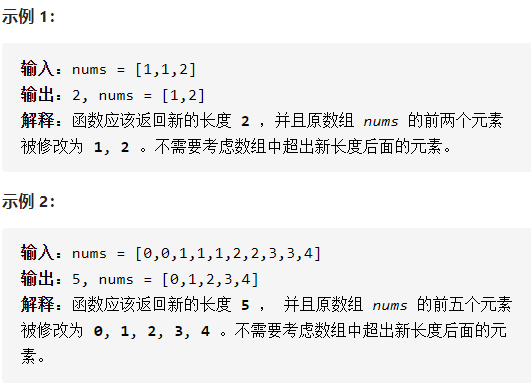
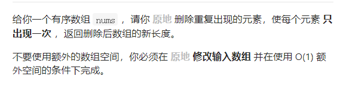

删除有序数组重复项





详细思路

双指针，leftright，right不断找新数字，left不断存储合适的数字，left每次走都要计数，如果left和right相同说明重复了right++，如果不同说明不重复放进来leftright++

精确定义

left已经不重复

ans 不重复的个数

right是需要检查的数字

```c
class Solution {
public:
    int removeDuplicates(vector<int>& nums) {
        if(nums.size()==0)return 0;
        int ans=1,left=0,right=1;
        while(right<nums.size()){
            if(nums[left]==nums[right])right++;
            else{
                left++;
                nums[left]=nums[right];
                ans++;
                right++;
            }
        }
        return ans;
    }
};
```

