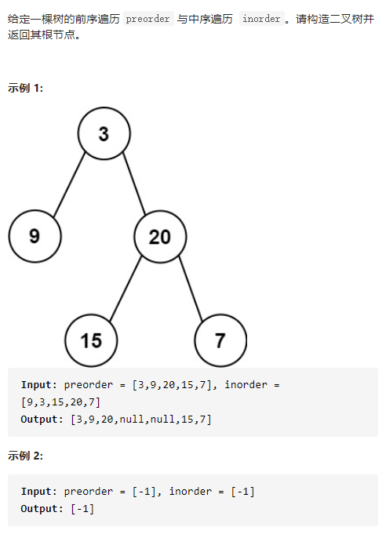

从前序与中序遍历序列构造二叉树



详细思路

dfs，参数left1，right1是一棵树的前序遍历节点范围，left2right'2是一棵树的中序遍历节点范围，preorder inorder是携带数据，dfs可以构建出一棵完整的树，只需要找到根结点，再找到左子树的四个参数，右子树的四个参数，dfs构造左子树和右子树并连接，怎么找到四个参数？前序遍历第一个节点就是根结点，根结点值映射到中序遍历根结点的下标找到中序遍历根结点下标，左边就是左子树，右边就是右子树

精确定义

dfs 参数left1是一棵树前序遍历第一个，right1是一棵树前序遍历最后一个，如果left1>right1空返回nullptr，最后返回

index 中序值映射下标

```c
class Solution {
public:
    TreeNode* buildTree(vector<int>& preorder, vector<int>& inorder) {
        int n=preorder.size();
        unordered_map<int,int>index;
        for(int i=0;i<inorder.size();i++){
            index[inorder[i]]=i;
        }
        return dfs(0,n-1,0,n-1,preorder,inorder,index);
    }
    TreeNode*dfs(int left1,int right1,int left2,int right2,vector<int>&preorder,vector<int>&inorder,unordered_map<int,int>&index){
        if(left1>right1)return nullptr;
        int rootVal=preorder[left1];
        int rootIndex=index[rootVal];
        int leftTreeLen=rootIndex-left2;
        TreeNode*leftTree=dfs(left1+1,left1+leftTreeLen,left2,rootIndex-1,preorder,inorder,index);
        TreeNode*rightTree=dfs(left1+leftTreeLen+1,right1,rootIndex+1,right2,preorder,inorder,index);
        return new TreeNode(rootVal,leftTree,rightTree);
    }
};
```

