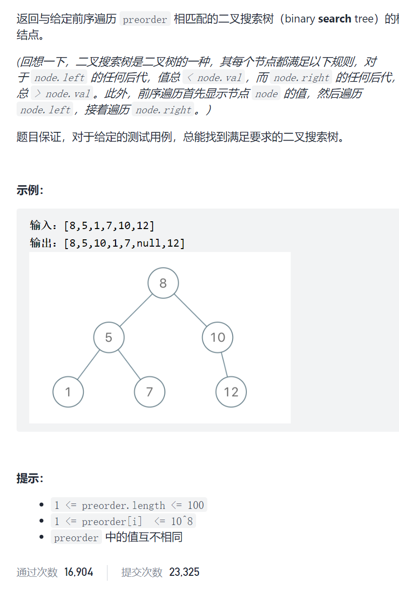
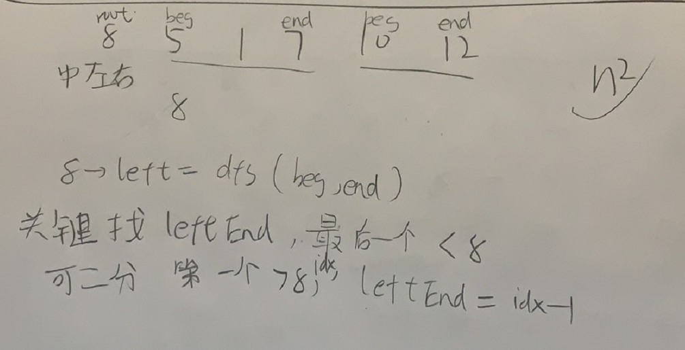

前序遍历构造二叉搜索树



抽象图一二ij

```c
class Solution {
public:
    TreeNode* bstFromPreorder(vector<int>& preorder) {
        return dfs(0,preorder.size()-1,preorder);
    }
    TreeNode*dfs(int beg,int end,vector<int>&preorder){
        if(beg>end)return nullptr;
        TreeNode*root=new TreeNode(preorder[beg]);
        int leftBeg=beg+1,leftEnd=beg;
        while(leftEnd+1<=end&&preorder[leftEnd+1]<preorder[beg])leftEnd++;
        root->left=dfs(leftBeg,leftEnd,preorder);
        int rightBeg=leftEnd+1;
        int rightEnd=end;
        root->right=dfs(rightBeg,rightEnd,preorder);
        return root;

    }
};

```

二分

```c
class Solution {
public:
    TreeNode* bstFromPreorder(vector<int>& preorder) {
        return dfs(0,preorder.size()-1,preorder);
    }
    TreeNode*dfs(int beg,int end,vector<int>&preorder){
        if(beg>end)return nullptr;
        TreeNode*root=new TreeNode(preorder[beg]);
        int leftBeg=beg+1;
        
        //二分
        int left=beg,right=end;
        while(left<right){
            int mid=left+(right-left)/2;
            if(preorder[mid]>preorder[beg])right=mid;
            else left=mid+1;
        }
        int leftEnd=left-1;
        if(preorder[left]<=preorder[beg])leftEnd=end;
        //二分结束

        root->left=dfs(leftBeg,leftEnd,preorder);
        int rightBeg=leftEnd+1;
        int rightEnd=end;
        root->right=dfs(rightBeg,rightEnd,preorder);
        return root;

    }
};
```

