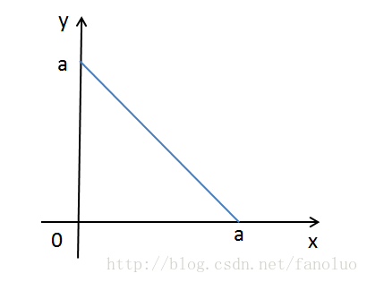

**题目：一段绳子，裁两刀，变成3段，可以拼成一个三角形的概率有多大

设线段长度为a，任意分成三段长分别为x，y和a-x-y，显然有x>0，y>0，a-x-y>0，将这三个约束条件画到(x,y)二维平面坐标系上，这三条直线围成了一个直角三角形即为可行域（图1），其面积为(1/2)a^2。

而这三段长能构成三角形的条件是：任意两边之和大于第三边，也就是下面三个不等式得同时成立：
x + y > a - x - y (x + y < a/2)
x + a - x - y > y (y < a/2)
y + a - x - y > x (x < a/2)

我们把上面三个不等式也画在平面直角坐标系中，可以看到可行域为图2中绿色的小三角形，其面积为:(1/8)a^2 ，占整个三角形的1/4。

故此三段能构成三角形的概率为1/4。

图1. 将a分成三段，每段大于零

