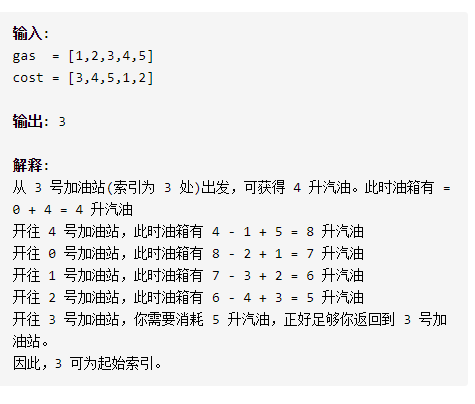
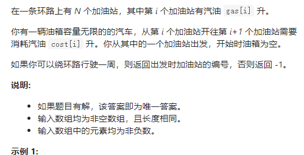

加油站



详细思路

从i开始，往右找j最远，如果j绕了一圈，return，如果j不能到达按个点，i从那个点开始判断，如果那个点是绕了一圈到原点或原点以后，没必要继续从那个点开始判断，说明return-1

精确定义

i这个点作为起点

j需要判断能否到达，从i+1开始判断

sumGas从i作为起点，到达j之前的汽油量

sumCost从i作为起点，到达j之前的耗油量

n总节点数

cnt从i开始，已经走过的节点数

```c
class Solution {
public:
    int canCompleteCircuit(vector<int>& gas, vector<int>& cost) {
        int i=0,n=gas.size();
        bool isok=false;
        while(i<n){
            if(i+1>=n)isok=true;
            int j=(i+1)%n,sumGas=gas[i],sumCost=cost[i],cnt=1;
            while(sumGas>=sumCost){
                //if(i==2)cout<<sumGas<<' '<<sumCost<<' '<<cnt<<endl;
                if(j+1>=n)isok=true;
                cnt++,sumGas+=gas[j],sumCost+=cost[j],j=(j+1)%n;
                if(cnt==n+1)return i;
            }
            if(isok)return -1;
            i=j;
        }
        return -1;
    }
}
```


踩过的坑

我错了cao，详细的思路一定要利用变量简洁正确完整的表达，精确的定义一定要严谨，

不然debug要死人的

int j=(i+1)%n

j=(j+1)%n;

isok

都是debug修改的，只要详细的思路一定要利用变量简洁正确又完整的表达，精确的定义一定要严谨，就可以通过几个错误例子debug出来