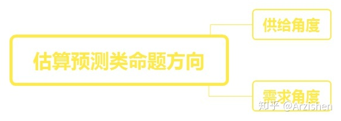
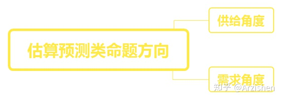
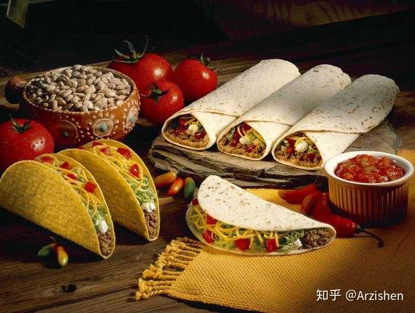

中国有多少个加油站？空的房间能装下多少爆米花？

笔试同类问题层出不穷，无从下手？

给我5分钟，构建你的专属[方法论](https://www.zhihu.com/search?q=方法论&search_source=Entity&hybrid_search_source=Entity&hybrid_search_extra={"sourceType"%3A"answer"%2C"sourceId"%3A437971394})，遇神杀神，遇佛杀佛。

**初衷**

简单来一个**自我介绍**，本人目前大三，最近在58实习，一直在成为一只产品汪的路上奋斗！

新人第一篇文章，希望各位大佬轻点喷，自学不易，要更努力。

这篇文章的初衷是为了各位奋斗在前线的，准备入职的，准备找实习的大佬们可以在日常产品工作中或者碰到这些**经典、潮流且无厘头**的问题的时候，可以闪现出那**1%的灵感**，利用下文所述的方法论所向披靡，过五关斩六将。

**切入正题**

近年来，互联网公司的面试题中总是会出现关于市场调研，对一类现象的规模预测问题，身边的朋友们总是无可奈何，无从下手。

经典问题赏析

胡同口的煎饼摊一年卖多少个煎饼？（万年经典）

中国有多少个加油站？（万年经典too）

离你最近的超市在午夜十二点时货架上有几瓶330ml的可乐？（2018路口笔试题）

一辆公交车里能装下多少个乒乓球？

一个空的房间能装下多少爆米花？

预测国内资讯类APP的DAU天花板（2018今日头条产品笔试题）

**这些题目可以说是产品小白们在校招求职路上的重大“门槛”，接下来让我们脱掉这些题目的外衣，看看复杂的外衣底下到底藏着一颗怎样单纯的心！**

**命题共同点归纳**

好了（正经脸），不难发现，以上的例子都有一个共同点：

归纳为：难以准确统计的规模预测与逻辑猜想，这类问题通常是关于给定限定信息的有可能计算的数量的猜想的验证。（学术界称为[费米问题](https://www.zhihu.com/search?q=费米问题&search_source=Entity&hybrid_search_source=Entity&hybrid_search_extra={"sourceType"%3A"answer"%2C"sourceId"%3A437971394})）

但是作为有志成为一位改变世界的产品经理，只拥有正向思维是远远不够的，我们从反面来思考这个问题，会有许多不一样的收获。

**从公司的角度，公司为什么要出这些看起来无厘头的问题呢？**

**看起来是青铜题，其实是王者题！**

通过一个无法简单统计的市场规模问题，可以很好地反映出笔试者的逻辑思维以及对完全陌生的领域的合理切入角度。

本质就是在看你面对一个完全陌生的领域，短时间怎么入手，怎么给出自己的判断，以及在这个过程中你的逻辑推理，是否步步到位，考虑周全。

个人觉得通过这种题目可以将每个人的思维淋漓尽致的体现，看看你是否具备成为一名出色的员工的潜在资质。

**方法论总结**

总结过许多这类问题的问题以及结合自己专业所学的知识，祭出真正的尚方宝剑。

方法论=正确的分析方向（标重点）*化解原命题成不可再分的最小命题*原命题与最小命题之间的比例关系*最小命题的[平均数](https://www.zhihu.com/search?q=平均数&search_source=Entity&hybrid_search_source=Entity&hybrid_search_extra={"sourceType"%3A"answer"%2C"sourceId"%3A437971394})

**相信公式这里大家都可以推导出来，然而方向才是至关重要的。**

这里推荐大家思考此类问题从供给与需求的方向。

**供给与需求方向，如果选对，事半功倍。**

倘若选错，那就换一个。

例如胡同口的煎饼摊一年卖出多少个煎饼的问题

从供给来说，由于煎饼制作工艺的即时性（即不存在存货的情况），我们只需算出煎饼摊每天制作的煎饼数量即可。

倘若是从需求角度来说，我们要至少要计算煎饼摊每天的人口流量、购买率、购买数量等等因素才可以得到最终答案。

显然是供给方面的准确程度及易算程度>需求方向的准确程度及易算程度

**在实例前有个问题需要阐述一下，作为一道开放题，这肯定是没有绝对性的答案的，公司考核的只是你的[逻辑思维](https://www.zhihu.com/search?q=逻辑思维&search_source=Entity&hybrid_search_source=Entity&hybrid_search_extra={"sourceType"%3A"answer"%2C"sourceId"%3A437971394})和思考过程，具体的数据并不是考核的重点。可以假设变量也可以依据已有的经验揣摩数据，只要确保分析合理即可。**

**案例分析一：煎饼摊一年卖多少个煎饼？**

**供给角度：问题转换成求摊主一年生产多少个煎饼？**

**需求角度 ： 问题转换成一年内顾客购买了多少个煎饼？**

显而易见，从供给角度进行分析问题会简单许多

一年内煎饼销量=一年内实际出摊天数*每天生产煎饼个数

每天生产煎饼个数=平均每小时生产煎饼个数*平均每天工作小时数

平均每小时生产煎饼个数=60/每生产一个煎饼所需要的时间

汇总得到 : 一年卖出的煎饼数（总）=一年内实际出摊天数*60/每生产一个煎饼所需要的时间*平均每天工作小时数

我们假设摊主6点出摊，工作到上午10点，下午4点出摊，工作到晚上9点，共计9小时。

假设每生产一个煎饼所需要的时间是3分钟，但是并不是每时每刻都有人在购买煎饼，所以假设真正在制造煎饼的时间占70%。

每天生产的煎饼个数为=60/3*9*70%=156个

考虑到摊主不会一年都全勤，其中有考虑下雨、节假日、城管等等因素，一年假设出摊300天。

所以，一年所卖的煎饼数为156*300=46800个。

只是提供一个思路，具体的计算因素还可以更多，可以细化许多因素，理论上越细微越精准越好，但是考虑到笔试的时间因素，个人觉得到这里就可以啦~

是不是很简单呢，我们再来一题实战哈！

**案例分析二：国内资讯类APP的DAU天花板**

**依然是供给与需求的角度的对比：**

**供给角度：国内各大资讯类App作品对用户的吸引活跃次数=国内各大资讯类App对手机端用户（独立IP）的访问数量统计**

**需求角度：国内网民每天访问资讯类APP（去掉重复）的次数统计**

（表述可能有点问题，大家谅解）

由于我们不可能已知供给角度下的各大资讯类App的DAU总和，所以本命题我们从需求角度进行分析

国内网民每天访问资讯类APP（重复不计）的次数统计=独立移动设备数量*平均访问资讯类App次数（重复不计）

独立移动设备数量=网民人数*人均拥有独立设备数量

平均访问资讯类App次数由于人口年龄层次的不同导致习惯不同，为此我们取[加权平均数](https://www.zhihu.com/search?q=加权平均数&search_source=Entity&hybrid_search_source=Entity&hybrid_search_extra={"sourceType"%3A"answer"%2C"sourceId"%3A437971394})。

平均访问资讯类App次数=（不同年龄层次的人口数量*不同年龄层次访问次数）/网民总数量

  资讯类APP的DAU天花板=网民人数*人均拥有独立设备数量*（不同年龄层次的人口数量*不同年龄层次访问次数）/网民总数量

网民人数为**7.5亿**（据[新浪财经](https://www.zhihu.com/search?q=新浪财经&search_source=Entity&hybrid_search_source=Entity&hybrid_search_extra={"sourceType"%3A"answer"%2C"sourceId"%3A437971394})的2017年互联网数据报告得知）

假设，每**5**个人（一个小家）里有一台平板电脑，则估计人均拥有独立设备为**1.2**台

独立移动设备数量=网民人数*人均拥有独立设备数量=**7.5亿\*1.2台=9亿台**

**人口年龄分布我们划分为0-18岁，18-30岁，30-50岁，50-无穷大四个层次，由于样本总体是网民，所以我们假设比例：**

0-18岁占 30%

18-30岁占40%

30-50岁占25%

50-无穷大占5%

**由于年龄层次的不同，习惯也不尽相同，取以下比例：**

0-18岁   平均每天访问0.2个APP（考虑到未成年人对这一块需求较小，5个人里有一个人保持每天一次的日活）

18-30岁   平均每天访问0.7个APP（10个人里7个人保持日活）

30-50岁   平均每天访问0.5个APP（10个人里5个人保持日活）

50-无穷大平均每天5% 平均每天访问0.1个APP（10个人里1个人保持日活）

**故平均访问资讯类App次数=30%\*0.2+40%\*0.7+25%\*0.5+5%\*0.1=0.515次**

国内网民每天访问资讯类APP（重复不计）的次数统计=独立移动设备数量*平均访问资讯类App次数（重复不计）=**9\*0.515=4.635（亿/次）**

**做到这里，我们顺手计算一下头条的DAU，假设头条市场占有率为20%，腾讯20%，网易20%，其他等共计40%,那么头条的DAU应该是4.635\*20%=9270万，腾讯亦然。**

算完以后，我特地找了头条数据中心给出的数据，2016年头条的日均DAU为7800万

**不过现在都是2018年了，头条的DAU应该达到了9000万+了吧。**

由于我取的维度比较简单以及数据的不准确性，与最终答案有一定差别。

只是一个思路，希望大家能够理解做题的思路以及构建自己的方法论。

**总结**

说了这么多经（fei）验(hua)，简单总结一下方法论。

最重要的是选好方向，供给与需求的方向只要选好，事半功倍啦。

一步一步拆解问题，细化，平均，让你的细心、踏实、逆向思维展现的淋漓尽致，那你离Offer收割机就不远啦。

第一次分享自己的一些心得体验，要一直努力的，希望大家给出你们的意见，狠狠的批判我的同时~

**还能顺手给个赞**

**感激不尽**

送上最喜欢的一句话，[世间一切皆悖论](https://www.zhihu.com/search?q=世间一切皆悖论&search_source=Entity&hybrid_search_source=Entity&hybrid_search_extra={"sourceType"%3A"answer"%2C"sourceId"%3A437971394})--这句话也是。