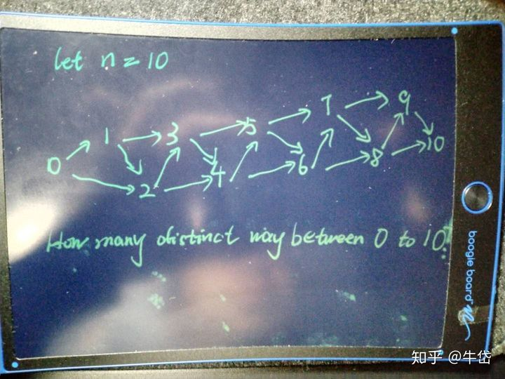

我觉得大部分高赞答案把简单的概念搞复杂了。

**quora**上有这样一个问题:

**How should I explain dynamic programming to a 4-year-old?**

底下有个42K赞同的答案，是这样说的：

***writes down "1+1+1+1+1+1+1+1 =" on a sheet of paper\***

**"What's that equal to?"**

***counting\* "Eight!"**

***writes down another "1+" on the left\***

**"What about that?"**

***quickly\* "Nine!"**

**"How'd you know it was nine so fast?"**

**"You just added one more"**

**"So you didn't need to recount because you remembered there were eight!\*Dynamic Programming\* is just a fancy way to say 'remembering stuff to save time later'"**

就不翻译了，相信大家都能看懂。

按照定义，动态规划是把一个大问题拆解成一堆小问题，这个本身没啥问题，但是我觉得的这个不是[动态规划](https://www.zhihu.com/search?q=动态规划&search_source=Entity&hybrid_search_source=Entity&hybrid_search_extra={"sourceType"%3A"answer"%2C"sourceId"%3A612439961})的核心思想，或者说，一个”大问题“之所以能用”动态规划“解决，并不是因为它能拆解成一堆小问题，事实上啥大问题都能拆解成小问题...

**取决于该问题是否能用动态规划解决的是这些”小问题“会不会被被重复调用。**

举个例子，有n个阶梯，一个人每一步只能跨一个台阶或是两个台阶，问这个人一共有多少种走法？

首先要对这个问题进行抽象，n个阶梯，每个阶梯都代表一个”位置“， 就像是图论中的一个”点“，然后这些n个不同位置之间会有一些桥梁把它们连起来：

这个图，就是该问题的抽象表达形式，那么这个问题就转化成了从 Node 0 到 Node 10 有几种不同的路可以走？

其实这个就是问题的本质了。

那么如果我在计算出了从 5 到 10 的路径数，这个路径数是不是可以保存下来？

为什么要保存？因为这个信息一会儿还要再次被用到！

因为不管我是从3走过来的，还是从4走过来的，走到5之后，存在的路径就是第一次计算出的结果，你无需重复计算！

如果是暴力遍历的话，从 3 到 10 的时候， 你肯定会把 5 - 10 的可能路径数都算一遍，然后从 4 到 10 的时候，你又会把 5 - 10的路径算一遍，也就是重复计算了~

那么既然这样，我们创建一个数组a[]，专门来存放位点 x 到 10 的所有可能路径数，初始值记为 0，然后每当要计算 x 到 10 的路径数时，先检测一下该路径数的值是不是大于 0 ，如果大于，就说明它之前已经被计算过，并存在了a[x]中了!

那么我们马上可以得到一个[递推关系](https://www.zhihu.com/search?q=递推关系&search_source=Entity&hybrid_search_source=Entity&hybrid_search_extra={"sourceType"%3A"answer"%2C"sourceId"%3A612439961}):

a[x] = a[x+1] + a[x+2];

那么举个例子:

a[6] = a[7] + a[8];

a[7] = a[8] + a[9];

我们发现, 在计算 a[6] 和 a[7] 的时候, 我们都用了a[8]，也就是被**重复利用了结果**。