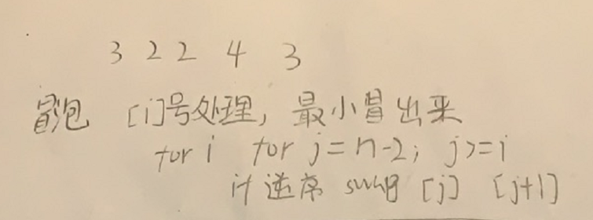
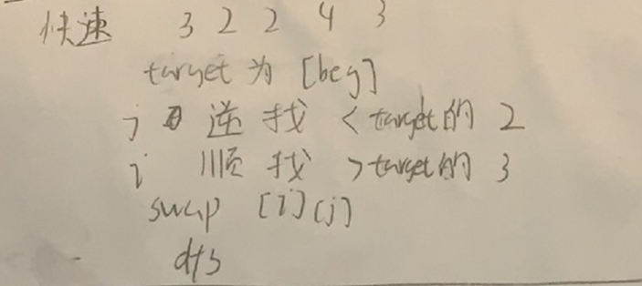
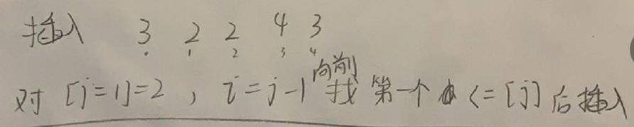
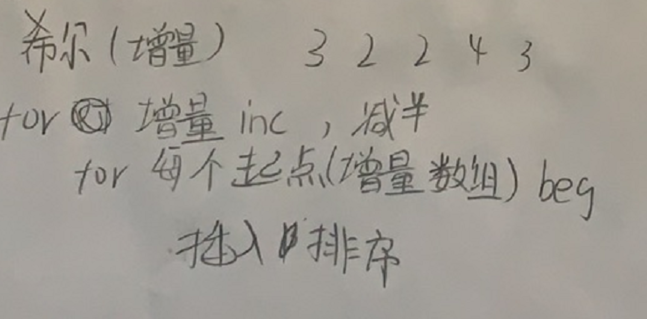
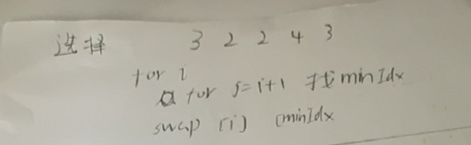
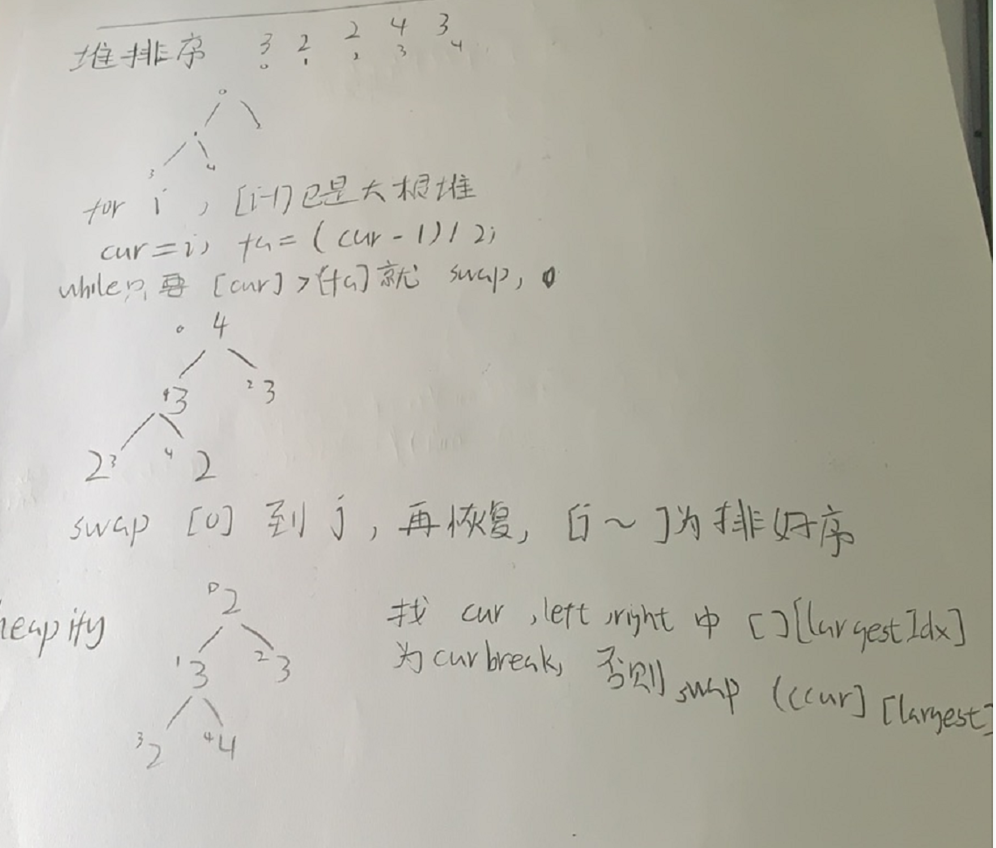
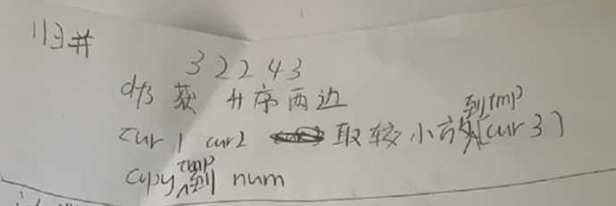
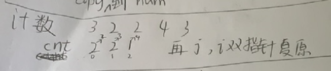
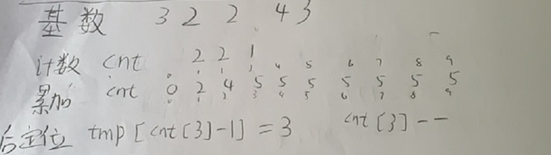
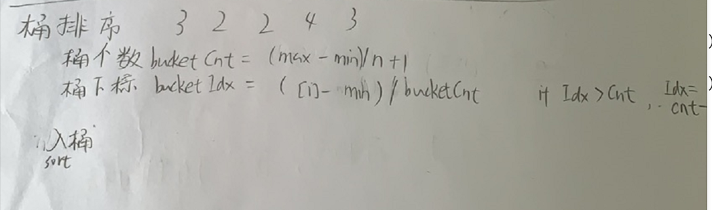

十大排序

冒泡排序



```c
class Solution {
public:
    vector<int> sortArray(vector<int>& nums) {
        int n=nums.size();
        for(int i=0;i<n;i++){
            bool flag=false;
            for(int j=n-2;j>=i;j--){
                if(nums[j]>nums[j+1]){
                    swap(nums[j],nums[j+1]);
                    flag=true;
                }
            }
            if(flag==false)break;
        }
        return nums;
    }
};
```




快速排序

```c
class Solution {
public:
    vector<int> sortArray(vector<int>& nums) {
        int n=nums.size();
        dfs(0,n-1,nums);
        return nums;
    }
    void dfs(int beg,int end,vector<int>&nums){
        if(beg>end)return;
        int i=beg,j=end;
        while(i<j){
            while(nums[j]>=nums[beg]&&i<j)j--;
            while(nums[i]<=nums[beg]&&i<j)i++;
            if(i<j)swap(nums[i],nums[j]);
        }
        swap(nums[beg],nums[i]);
        dfs(beg,i-1,nums);
        dfs(i+1,end,nums);
    }
};
```




插入排序

```c
class Solution {
public:
    vector<int> sortArray(vector<int>& nums) {
        int n=nums.size();
        for(int j=1;j<n;j++){
            int tmp=nums[j];
            int i=j-1;
            while(i>=0&&nums[i]>tmp){
                nums[i+1]=nums[i];
                i--;
            }
            nums[i+1]=tmp;
        }
        return nums;
    }
};
```




希尔排序

```c
class Solution {
public:
    vector<int> sortArray(vector<int>& nums) {
        int n=nums.size();
        for(int inc=n/2;inc>=1;inc/=2){
            for(int beg=0;beg<=inc-1;beg++){
                for(int j=beg+inc;j<n;j++){
                    int i=j-inc;
                    int tmp=nums[j];
                    while(i>=beg&&nums[i]>tmp){
                        nums[i+inc]=nums[i];
                        i-=inc;
                    }
                    nums[i+inc]=tmp;
                }
            }
        }
        return nums;
    }
};
```




选择排序

```c
class Solution {
public:
    vector<int> sortArray(vector<int>& nums) {
        int n=nums.size();
        for(int i=0;i<n;i++){
            int minIdx=i;
            for(int j=i+1;j<n;j++){
                if(nums[j]<nums[minIdx])minIdx=j;
            }
            swap(nums[i],nums[minIdx]);
        }
        return nums;
    }
};
```




堆排序，通过

```c
class Solution {
public:
    vector<int> sortArray(vector<int>& nums) {
        int n=nums.size();
        for(int i=0;i<n;i++){
            int cur=i;
            int fa=(cur-1)/2;
            while(nums[cur]>nums[fa]){
                swap(nums[cur],nums[fa]);
                cur=fa;
                fa=(cur-1)/2;
            }
        }
        for(int j=n-1;j>=0;j--){
            swap(nums[0],nums[j]);
            heapify(nums,0,j);
        }
        return nums;
    }
    void heapify(vector<int>&nums,int cur,int n){
        int left=cur*2+1,right=cur*2+2;
        while(left<n){
            int largestIdx=cur;
            if(left<n&&nums[left]>nums[largestIdx])largestIdx=left;
            if(right<n&&nums[right]>nums[largestIdx])largestIdx=right;
            if(largestIdx==cur)break;
            swap(nums[cur],nums[largestIdx]);
            cur=largestIdx;
            left=cur*2+1,right=cur*2+2;
        }
    }
};
```




归并，通过

```c
class Solution {
public:
    vector<int> sortArray(vector<int>& nums) {
        int n=nums.size();
        vector<int>tmp(n);
        dfs(0,n-1,nums,tmp);
        return nums;
    }
    void dfs(int beg,int end,vector<int>&nums,vector<int>&tmp){
        if(beg>=end)return ;
        int mid=beg+(end-beg)/2;
        dfs(beg,mid,nums,tmp);
        dfs(mid+1,end,nums,tmp);
        int cur1=beg,cur2=mid+1,cur3=beg;
        while(cur1<=mid||cur2<=end){
            if(cur2>end||cur1<=mid&&nums[cur1]<=nums[cur2]){
                tmp[cur3]=nums[cur1];
                cur1++,cur3++;
            }else if(cur1>mid||cur2<=end&&nums[cur1]>nums[cur2]){
                tmp[cur3]=nums[cur2];
                cur2++,cur3++;
            }
        }
        copy(tmp.begin()+beg,tmp.begin()+end+1,nums.begin()+beg);
    }
};
```




计数，通过

```c
class Solution {
public:
    vector<int> sortArray(vector<int>& nums) {
        int n=nums.size();
        int minNum=*min_element(nums.begin(),nums.end());
        int maxNum=*max_element(nums.begin(),nums.end());
        vector<int>cnt(maxNum-minNum+1);
        for(auto &num:nums)cnt[num-minNum]++;
        int j=0,i=0;
        while(i<cnt.size()){
            while(cnt[i]>0){
                nums[j++]=i+minNum;
                cnt[i]--;
            }
            i++;
        }
        return nums;
    }
};
```




基数，通过

```c
class Solution {
public:
    vector<int> sortArray(vector<int>& nums) {
        int n=nums.size();
        int minNum=*min_element(nums.begin(),nums.end());
        for(auto&num:nums)num-=minNum;
        int maxNum=*max_element(nums.begin(),nums.end());
        int maxBit=1,curNum=10;
        while(curNum<=maxNum){
            maxBit++;
            curNum*=10;
        }
        vector<int>tmp(n);
        for(int i=0,place=1;i<maxBit;i++,place*=10){
            vector<int>cnt(10);
            for(int j=0;j<n;j++)cnt[nums[j]/place%10]++;
            for(int j=1;j<10;j++)cnt[j]+=cnt[j-1];
            for(int j=n-1;j>=0;j--){
                int bitNum=nums[j]/place%10;
                tmp[cnt[bitNum]-1]=nums[j];
                cnt[bitNum]--;
            }
            copy(tmp.begin(),tmp.end(),nums.begin());
        }
        for(auto&num:nums)num+=minNum;
        return nums;
    }
};
```


桶排序



```c
class Solution {
public:
    vector<int> sortArray(vector<int>& nums) {
        int n=nums.size();
        int maxNum=*max_element(nums.begin(),nums.end());
        int minNum=*min_element(nums.begin(),nums.end());
        int bucketCnt=(maxNum-minNum)/n+1;
        vector<vector<int>>buckets(bucketCnt);
        for(auto &num:nums){
            int bucketIdx=(num-minNum)/bucketCnt;
            if(bucketIdx>=bucketCnt)bucketIdx=bucketCnt-1;
            buckets[bucketIdx].push_back(num);
        }
        nums.clear();
        for(auto&bucket:buckets){
            sort(bucket.begin(),bucket.end());
            for(int &num:bucket)nums.push_back(num);
        }
        return nums;
    }
};
```

