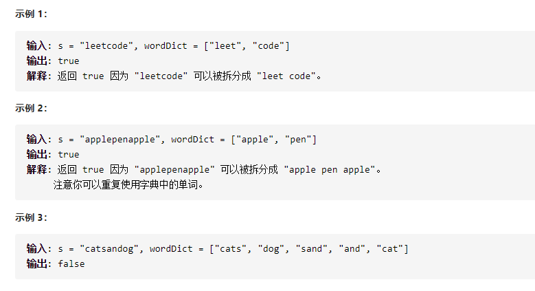

单词拆分



变量简洁正确完整思路

dpi具有某种递推关系，

精确定义

dp i 0到i的字符串能否用dict表示，dp0是空，dp1是第一个字符

转移

\- - a b c 

if s[j..i]在dict中某一个字符串并且dpj=1则dpi=1，且不用继续找dpj

查找方法，将dict放入哈希集dict中进行查找

初始化

dp 0=1 空，可以匹配

```c
class Solution {
public:
    bool wordBreak(string s, vector<string>& wordDict) {
        int n=s.size();
        vector<int>dp(n+1,0);
        unordered_set<string>dict(wordDict.begin(),wordDict.end());
        dp[0]=1;
        for(int i=1;i<=n;i++){
            for(int j=0;j<i;j++){
                if(dp[j]&&dict.count(s.substr(j,i-j))){
                    dp[i]=1;
                    break;
                }
            }
        }
        return dp[n];
    }
};

```

剪枝思路

s[j,i]要在dict找，那么i-j长度只需要在dict最长和最短的单词之间就行，i从最短的开始，

i-j也有范围