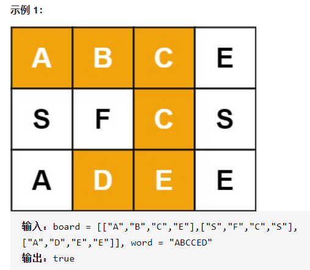

单词搜索



详细思路

dfs，每个格子都可以作为入口，上下左右遍历，vis防止重复使用，每次入口都要重置vis，上下左右是需要的单词才能进入

精确定义

depth需要处理的第几个单词下标，当==n就是答案true

x已经处理好的

y已经处理好的

```c
class Solution {
public:
    bool ans=false;
    int xx[4]={1,-1,0,0},yy[4]={0,0,1,-1};
    bool exist(vector<vector<char>>& board, string word) {
        int n=board.size(),m=board[0].size();
        vector<vector<int>>vis(n,vector<int>(m,0));
        for(int i=0;i<n;i++){
            for(int j=0;j<m;j++){
                if(board[i][j]==word[0]){
                    vis[i][j]=1;
                    dfs(i,j,1,board,word,vis,n,m);
                    if(ans)return true;
                    vis[i][j]=0;
                }
            }
        }
        return false;
    }
    void dfs(int x,int y,int depth,vector<vector<char>>& board, string word,vector<vector<int>>&vis,int n,int m){
        if(depth==word.size()){
            ans=true;
            return;
        }
        for(int i=0;i<4;i++){
            int dx=x+xx[i];
            int dy=y+yy[i];
            if(dx>=0&&dx<n&&dy>=0&&dy<m&&!vis[dx][dy]&&board[dx][dy]==word[depth]){
                vis[dx][dy]=1;
                dfs(dx,dy,depth+1,board,word,vis,n,m);
                vis[dx][dy]=0;
            }
        }
    }
};
```

踩过的坑

用函数参数代替全局变量更稳定，vis不要放在全局变量处

​          vis[i][j]=1;

​          dfs(i,j,1,board,word,vis,n,m);

​          if(ans)return true;

​          vis[i][j]=0;

​        vis[dx][dy]=1;

​        dfs(dx,dy,depth+1,board,word,vis,n,m);

​        vis[dx][dy]=0;

回溯回溯，作为函数参数应该时刻想着修改了就准备回溯

