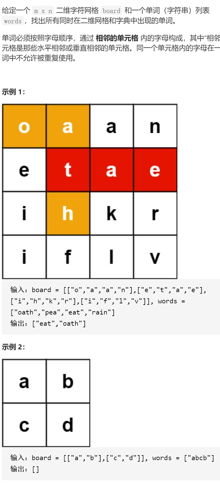

单词搜索II

变量简洁正确完整思路

暴力dfs，分为dfs开头判断和dfs入口判断两种方法，目前来看都可以，而且没有什么区别，但是第一种更加像递归，用第一种，还有注意第一种for循环前后要vis、ans1

但是第一种有一个严重的问题，想要回溯vis很容易，for前后就行，但是想要回溯

ans1就非常麻烦，你不能用pop，因为pop放在for循环里导致pop过度，放在return

前面pop过少，只能够for循环前tmp保存ans1并在每次dfs后面ans1修改为tmp，或者

ans1不要用&，而是用值传递的方法，建议使用&+tmp

```c
class Solution {
public:
    vector<string> findWords(vector<vector<char>>& board, vector<string>& words) {
        int n=board.size(),m=board[0].size();
        vector<string>ans;
        for(string word:words){
            for(int i=0;i<n;i++){
                for(int j=0;j<m;j++){
                    if(!ans.empty()&&ans.back()==word)break;
                    vector<vector<int>>vis(n,vector<int>(m,0));
                    dfs(0,i,j,board,word,vis,ans,n,m);
                }
            }
        }
        return ans;
    }
    void dfs(int beg,int x,int y,vector<vector<char>>&board,string&word,vector<vector<int>>&vis,vector<string>&ans,int n,int m){
        if(x<0||x>=n||y<0||y>=m||vis[x][y]||board[x][y]!=word[beg])return;
        if(!ans.empty()&&ans.back()==word)return;
        if(beg==word.size()-1){
            ans.push_back(word);
            return;
        }
        vis[x][y]=1;
        int xx[4]={1,-1,0,0},yy[4]={0,0,1,-1};
        for(int i=0;i<4;i++){
            int dx=xx[i]+x,dy=yy[i]+y;
            dfs(beg+1,dx,dy,board,word,vis,ans,n,m);
        }
        vis[x][y]=0;
    }
};
class Solution {
public:
    vector<string> findWords(vector<vector<char>>& board, vector<string>& words) {
        int n=board.size(),m=board[0].size();
        vector<string>ans;
        for(string word:words){
            for(int i=0;i<n;i++){
                if(!ans.empty()&&ans.back()==word)break;
                for(int j=0;j<m;j++){
                    if(board[i][j]==word[0]){
                        if(!ans.empty()&&ans.back()==word)break;
                        vector<vector<int>>vis(n,vector<int>(m,0));
                        vis[i][j]=1;
                        dfs(1,i,j,board,word,vis,ans,n,m);
                    }
                }
            }
        }
        return ans;
    }
    void dfs(int beg,int x,int y,vector<vector<char>>&board,string&word,vector<vector<int>>&vis,vector<string>&ans,int n,int m){
        if(!ans.empty()&&ans.back()==word)return;
        if(beg==word.size()){
            ans.push_back(word);
            return;
        }
        int xx[4]={1,-1,0,0},yy[4]={0,0,1,-1};
        for(int i=0;i<4;i++){
            int dx=xx[i]+x,dy=yy[i]+y;
            if(dx>=0&&dx<n&&dy>=0&&dy<m&&!vis[dx][dy]&&word[beg]==board[dx][dy]){
                vis[dx][dy]=1;
                dfs(beg+1,dx,dy,board,word,vis,ans,n,m);
                vis[dx][dy]=0;
            }

        }
    }
};
```

变量简洁正确完整思路

利用Trie树保存字典，dfs开头判断，越界vis提前返回，更新ans1，更新后判断

不能startWith提前返回，能search更新答案ans，

ans1，

```c
struct Tire{
    bool isEnd;
    Tire*next[26];
    Tire(){
        isEnd=false;
        memset(next,0,sizeof(next));
    }
    void insert(string word){
        Tire*root=this;
        for(char c:word){
            if(!root->next[c-'a'])root->next[c-'a']=new Tire();
            root=root->next[c-'a'];
        }
        root->isEnd=1;
    }
    bool search(string word){
        Tire*root=this;
        for(char c:word){
            root=root->next[c-'a'];
            if(!root)return false;
        }
        if(root->isEnd){
            root->isEnd=0;
            return true;
        }
        return false;
    }
    bool startsWith(string word){
        Tire*root=this;
        for(char c:word){
            root=root->next[c-'a'];
            if(!root)return false;
        }
        return true;
    }
};
class Solution {
public:
    vector<string> findWords(vector<vector<char>>& board, vector<string>& words) {
        int n=board.size(),m=board[0].size();
        vector<string>ans;
        vector<vector<int>>vis(n,vector<int>(m,0));
        Tire*root=new Tire();
        for(auto word:words)root->insert(word);
        for(int i=0;i<n;i++){
            for(int j=0;j<m;j++){
                string ans1;
                dfs(i,j,ans1,ans,board,vis,root,n,m);
            }
        }
        return ans;
    }
    void dfs(int x,int y,string &ans1,vector<string>&ans,vector<vector<char>>&board,vector<vector<int>>&vis,Tire*root, int n,int m){
        if(x<0||x>=n||y<0||y>=m||vis[x][y])return;
        ans1.push_back(board[x][y]);
        //cout<<x<<y<<ans1<<endl;
        //cout<<!root->startsWith(ans1)<<root->search(ans1)<<endl;
        if(!root->startsWith(ans1))return;
        if(root->search(ans1))ans.push_back(ans1);
        vis[x][y]=1;
        string tmp=ans1;
        int xx[4]={1,-1,0,0},yy[4]={0,0,1,-1};
        for(int i=0;i<4;i++){
            int dx=xx[i]+x,dy=yy[i]+y;
            dfs(dx,dy,ans1,ans,board,vis,root,n,m);
            ans1=tmp;
        }
        vis[x][y]=0;
    }
};
```


踩过的坑

1、在dfs函数开头判断而不是等到dfs入口

2、vis在for上下使用

3、ans1在for上保存未tmp，在dfs后面调用，或者直接用值传递

4、防止重复使用字典树search到的word，可以search中将isEnd=false