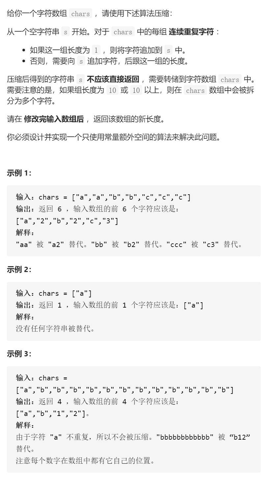

压缩字符串



抽象关键过程关键变量

right收集过程，用right-tmp得到长度，left结算过程，修改字符+数字，先写框架

```c
class Solution {
public:
    int compress(vector<char>& chars) {
        int right=0,left=0;
        int n=chars.size();
        while(right<n){
            int tmp=0;
            while(chars[tmp]==chars[right])right++;
            int len=right-tmp;

            left++;
            string lenStr=to_string(len);
            for(int i=0;i<lenStr.size();i++){
                chars[left]=lenStr[i];
                left++;
            }
        }
        return left;
    }   
};
```


debug

```c
class Solution {
public:
    int compress(vector<char>& chars) {
        int right=0,left=0;
        int n=chars.size();
        while(right<n){
            //cout<<left<<' '<<right<<endl;
            int tmp=right;
            while(right<n&&chars[tmp]==chars[right])right++;
            int len=right-tmp;

            chars[left]=chars[tmp];
            left++;
            if(len==1)continue;
            string lenStr=to_string(len);
            for(int i=0;i<lenStr.size();i++){
                chars[left]=lenStr[i];
                left++;
            }
        }
        return left;
    }   
};
```


