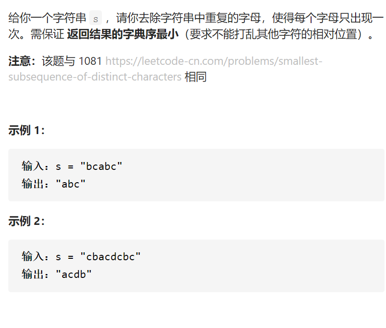

去除重复字母



变量简洁正确完整思路

去重用哈希集，相对顺序就像按顺序放到双端队列deq，字典序最小就用单调栈deq，遇到a，deq。front=c如果比a大而且后面还有c就要把front的cpop掉，让后面的c之后能进来，如bcabc

有bca和abc，遇到a，如果后面还有bc（用char2cnt表示a后面还有多少），且deqfront>a就应该popdeq并删掉哈希集，如何维护char2cnt，先遍历一遍全部，然后

b就cnt--，c就cnt--，

精确定义

char2cnt，遍历到c时后面的元素出现的次数

```c

class Solution {
public:
    string removeDuplicateLetters(string s) {
        unordered_set<char>seen;
        unordered_map<char,int>char2cnt;
        deque<char>deq;
        for(auto c:s)char2cnt[c]++;
        for(auto c:s){
            char2cnt[c]--;
            //cout<<c<<' '<<seen.count(c)<<endl;
            if(seen.count(c))continue;
            while(!deq.empty()&&char2cnt[deq.back()]>0&&deq.back()>c){
                //cout<<c<<' ';
                //cout<<c<<' '<<deq.back()<<' ';
                //cout<<endl;
                seen.erase(deq.back());
                deq.pop_back();
            }
            //cout<<c<<' '<<char2cnt[c]<<endl;
            seen.insert(c);
            //cout<<c<<' '<<seen.count(c)<<endl;
            deq.push_back(c);
        }
        string ans;
        while(!deq.empty()){
            ans.push_back(deq.front());
            deq.pop_front();
        }
        return ans;
    }
};

```

