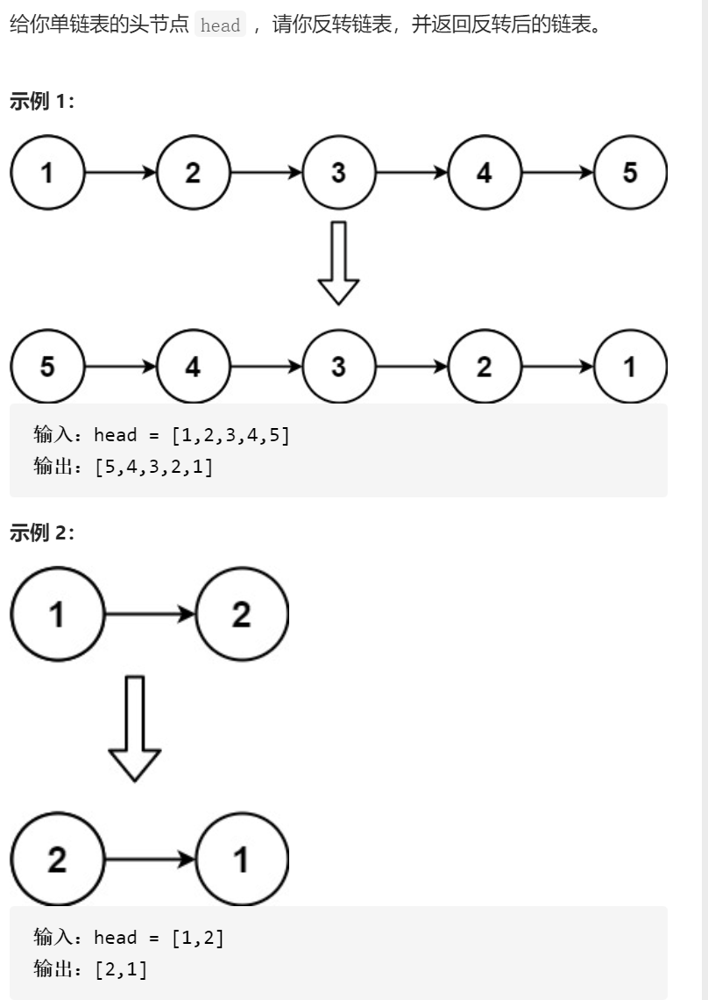
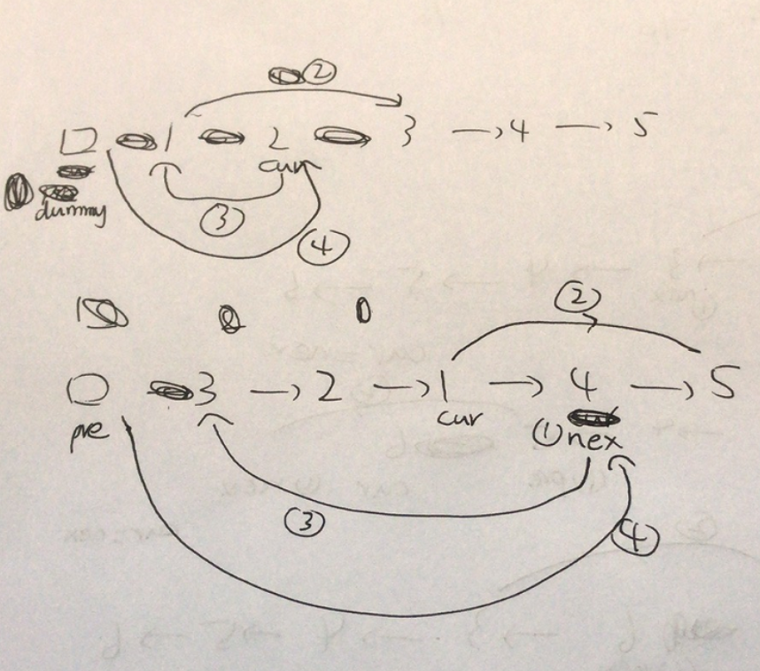

反转链表



变量简洁正确完整思路

画图，本来是cur需要处理，改成cur已经处理



```c
class Solution {
public:
    ListNode* reverseList(ListNode* head) {
        ListNode*dummy=new ListNode(-1,head);
        ListNode*cur=head;
        while(cur&&cur->next){
            ListNode*nex=cur->next;
            cur->next=nex->next;
            nex->next=dummy->next;
            dummy->next=nex;
        }
        return dummy->next;
    }
};
```

