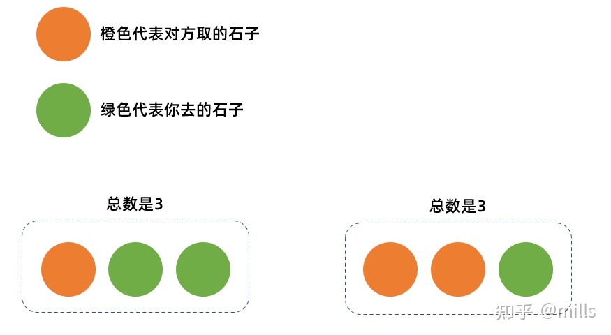
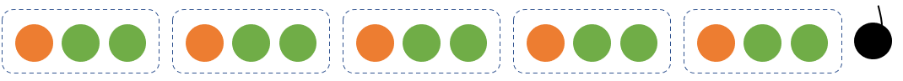
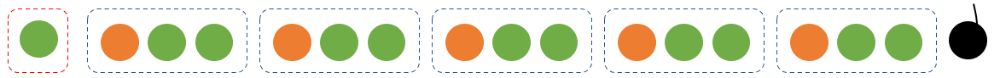

# 一

简单来说就是：

你不能左右另一个人取的数量。

但是，如果你后手，你可以让两人的[总和](https://www.zhihu.com/search?q=总和&search_source=Entity&hybrid_search_source=Entity&hybrid_search_extra={"sourceType"%3A"answer"%2C"sourceId"%3A1755475914})永远保持不变，也就是1+2=3

他取1，你取2；他取2你取1，如图：

**A情况：（后手必胜）**最简单的情况就是[石子](https://www.zhihu.com/search?q=石子&search_source=Entity&hybrid_search_source=Entity&hybrid_search_extra={"sourceType"%3A"answer"%2C"sourceId"%3A1755475914})的数量是3的倍数多1，谁拿到最后的这个石子就输。

只要你后手，这种情况必赢，如图：

**接着只需要将其他情况转换成A情况就好了。**

**B情况：（先手必胜）**石子的数量是3的倍数多2，那么就先拿掉1块，这样就变成了A情况。如图：

**c情况：（先手必胜）**石子数量是3的整数倍，那么先拿2块就转换成了A情况。如图：

# 二

共100个球,两个人轮流拿,每次至少拿2个,至多拿10个,拿最后一个球（第100个）的人输,问：第一个人采取什么策略,可

甲要胜出,最后一次拿完一定要最多剩2个球；
策略矩阵推导如下：
甲拿球时剩余范围VS乙拿球时剩余范围
（03,12）,（02,01）
（15,24）,（13,14）
（27,36）,（25,26）
（39,48）,（37,38）
（51,60）,（49,50）
（63,72）,（61,62）
（75,84）,（73,74）
（87,96）,（85,86）
（初始100）,（97,98）
甲的策略就是让乙拿球的时候剩余的球在右边对应的范围,第一次拿2个或3个