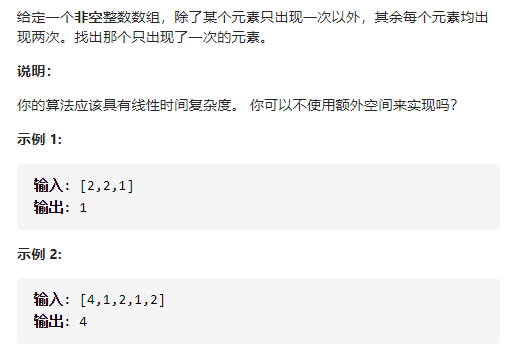
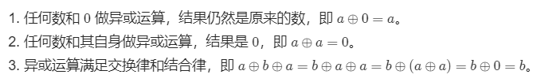
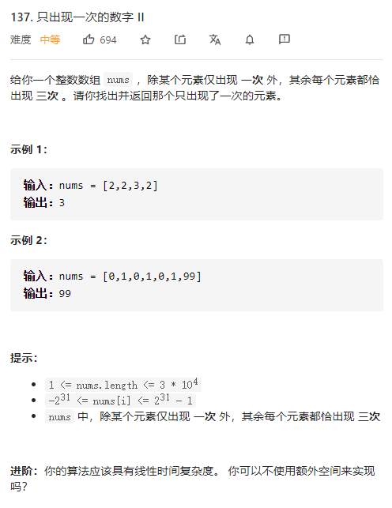
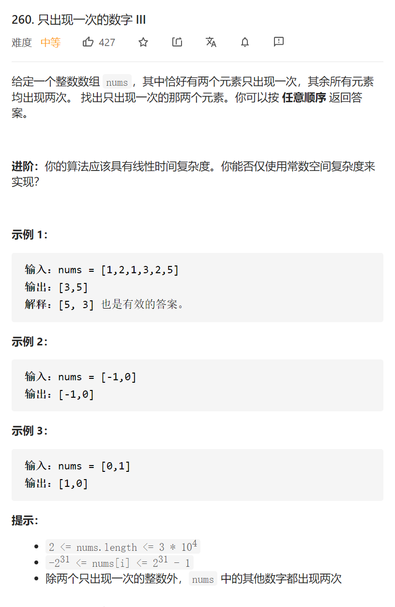

只出现一次的数字



变量简洁正确完整思路



和自身异或为0，和0异或为自身，满足交换律结合律

把所有num异或，出现2次的交换结合率后为0不影响其他num，最后只剩出现一次的

精确定义

ans初始化为第一个数字，然后和其余数字异或

```c
class Solution {
public:
    int singleNumber(vector<int>& nums) {
        int ans=nums[0];
        for(int i=1;i<nums.size();i++){
            ans^=nums[i];
        }
        return ans;
    }
};
```


------

只出现一次的数字



变量简洁正确完整思路

哈希表numToCnt，对于每个数nums[i]保存进numToCnt，遍历numToCnt，if it->second==1 return it->first

精确定义

```c

class Solution {
public:
    int singleNumber(vector<int>& nums) {
        unordered_map<int,int>numToCnt;
        for(int i=0;i<nums.size();i++){
            numToCnt[nums[i]]++;
        }
        for(auto mPair:numToCnt){
            if(mPair.second==1)return mPair.first;
        }
        return -1;
    }
};
```

踩过的坑

for(auto it:numToCnt){

mPair是<int,int>

变量简洁正确完整思路

所有出现3次的num[i]的同一个二进制位的和必定是3的倍数，所有nums[i]

同一位的和%3，结果是出现1次的ans的同一个二进制位，枚举32位第i位，枚举所有数第i位

的二进制为ansi+=(nums[j]>>i)&1，枚举完如果ansi%3==1，ans|=(1<<i)

精确定义

i第i位

j第j个数

ansi第i位二进制和

ans

```c
class Solution {
public:
    int singleNumber(vector<int>& nums) {
        int ans=0;
        for(int i=0;i<32;i++){
            int ansi=0;
            for(int j=0;j<nums.size();j++){
                ansi+=(nums[j]>>i)&1;
            }
            if(ansi%3==1)ans|=(1<<i);
        }
        return ans;
    }
};
```


------

只出现一次的数字III

变量简洁正确完整思路

异或，但是要的ab异或后为0110，1的为代表异或前不相等，也就是一个是a一个是b

，只需要找到某一个1，如最低位的1，得到div0010，则如果a&div==0则b&div！=0

ans1是=0的异或，ans2是！=0的异或

```c
class Solution {
public:
    vector<int> singleNumber(vector<int>& nums) {
        int tmp=0;
        for(int num:nums)tmp^=num;
        int div=1;
        while((div&tmp)==0)div<<=1;
        int ans1=0,ans2=0;
        for(int num:nums){
            if(num&div)ans1^=num;
            else ans2^=num;
        }
        return {ans1,ans2};
    }
};
```


踩过的坑

(div&tmp)==0  &的优先级很低