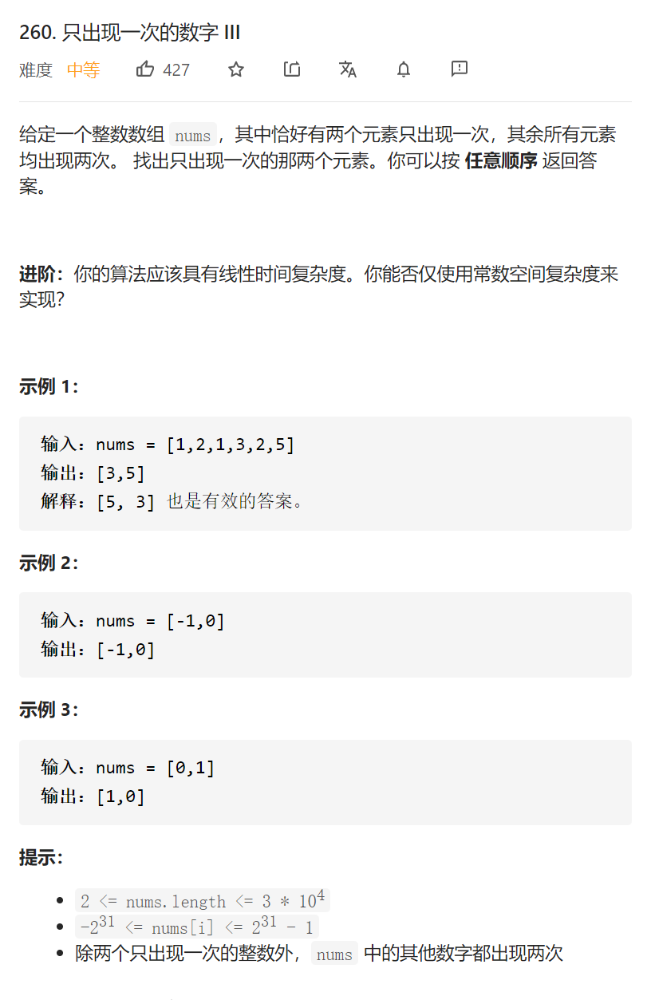

只出现一次的数字III


变量简洁正确完整思路

异或，但是要的ab异或后为0110，1的为代表异或前不相等，也就是一个是a一个是b

，只需要找到某一个1，如最低位的1，得到div0010，则如果a&div==0则b&div！=0

ans1是=0的异或，ans2是！=0的异或

```c
class Solution {
public:
    vector<int> singleNumber(vector<int>& nums) {
        int tmp=0;
        for(int num:nums)tmp^=num;
        int div=1;
        while((div&tmp)==0)div<<=1;
        int ans1=0,ans2=0;
        for(int num:nums){
            if(num&div)ans1^=num;
            else ans2^=num;
        }
        return {ans1,ans2};
    }
};
```


踩过的坑

(div&tmp)==0  &的优先级很低