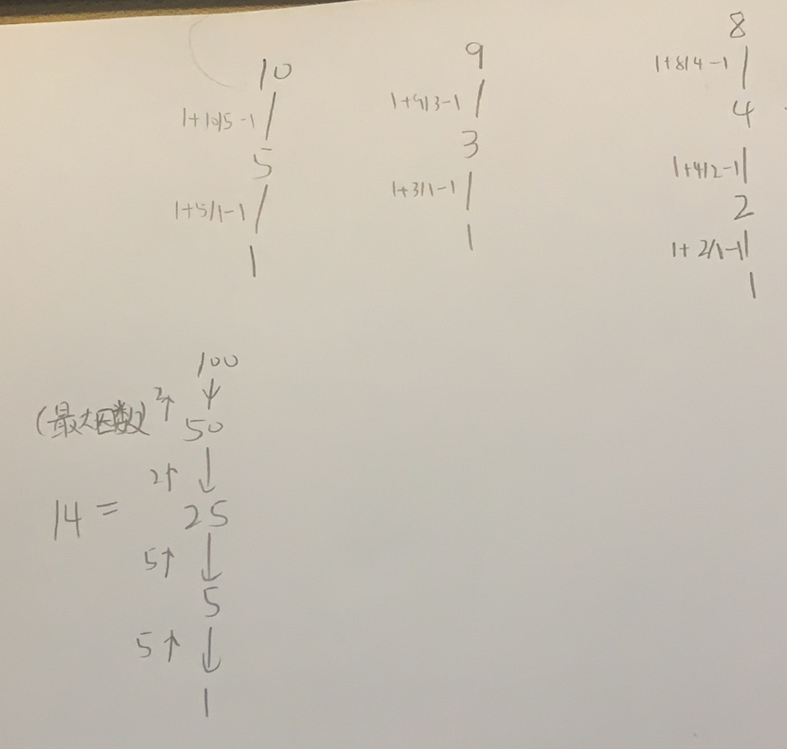

分解质因数

每个合数都可以写成几个[质数](https://baike.baidu.com/item/质数/263515)相乘的形式，其中每个质数都是这个[合数](https://baike.baidu.com/item/合数/49186)的因数，把一个合数用质因数[相乘](https://baike.baidu.com/item/相乘/10779094)的形式表示出来，叫做分解质因数。如30=2×3×5 。分解质因数只针对合数。

只有两个键的键盘


抽象图一二ij



```c
class Solution {
public:
    int minSteps(int n) {
        return dfs(n);
    }
    int dfs(int n){
        if(n==1)return 0;
        int newN=getN(n);
        return n/newN+dfs(newN);
    }
    int getN(int n){
        for(int i=2;i<=n;i++){
            if(n%i==0)return n/i;
        }
        return -1;
    }
};
```

节省时间的思路，将getN用数组预处理

节省空间的思路，将dfs写成循环

