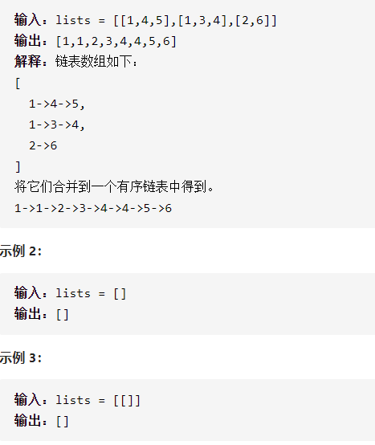

合并K个升序链表



详细思路

如果有第一条链表，作为新链表，对于输入的每一条链表，都和新链表合并，合并两链表需要建立哑结点，遍历两条链表，哪个小就接到第三条链表，一条为空了就把另一条剩余的接到第三条链表，复杂度[image:1627275123812.png]

精确定义

ans不断更新合并的链表

list和ans合并的链表

dummy合并的开始的节点，已经合并0个

cur1需要判断的第一条链表结点

cur2需要判断的第二条链表结点

cur3第三条链表已经合并了的节点

```c
class Solution {
public:
    ListNode* mergeKLists(vector<ListNode*>& lists) {
        int n=lists.size();
        if(n<1)return nullptr;
        ListNode*ans=lists[0];
        for(int i=1;i<n;i++){
            ans=mergeTwo(ans,lists[i]);
        }
        return ans;
    }
    ListNode*mergeTwo(ListNode*cur1,ListNode*cur2){
        ListNode*dummy=new ListNode(0);
        ListNode*cur3=dummy;
        while(cur1&&cur2){
            if(cur1->val<=cur2->val){
                cur3->next=cur1;
                cur3=cur3->next;
                cur1=cur1->next;
            }else{
                cur3->next=cur2;
                cur3=cur3->next;
                cur2=cur2->next;
            }
        }
        cur3->next=cur1?cur1:cur2;
        return dummy->next;
    }
};

```

详细思路

优先队列小顶堆，保存所有链表值、头结点、小顶堆，把所有链表的头结点和值放入，创建新链表哑结点和当前节点，每次小顶堆拿出最小的节点接到当前节点再把拿出节点下一个节点的值和节点放入

精确定义

q优先队列，头结点是 非空 最小的节点

status自定义，需要值，节点，小顶堆

head链表头结点和值

cur1已经合并的链表结点

minNode从优先队列拿出的最小节点

```c
class Solution {
public:
    struct Status{
        int val;
        ListNode*listNode;
        bool operator<(const Status&s)const{
            return val>s.val;
        }
    };  
    priority_queue <Status> q;
    ListNode* mergeKLists(vector<ListNode*>& lists) {
        ListNode*dummy=new ListNode(0);
        ListNode*cur1=dummy;
        for(auto head:lists){
            if(head)q.push({head->val,head});
        }
        while(!q.empty()){
            auto minNode=q.top();
            q.pop();
            if(minNode.listNode->next)q.push({minNode.listNode->next->val,minNode.listNode->next});
            cur1->next=minNode.listNode;
            cur1=cur1->next;
        }
        return dummy->next;
    }     
};
```

