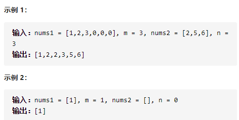

合并两个有序数组


详细思路

right是已经

cur1是需要cur2是需要

防止覆盖，逆向，大的right--放进去，--

```c
class Solution {
public:
    void merge(vector<int>& nums1, int m, vector<int>& nums2, int n) {
        int right=m+n,cur1=m-1,cur2=n-1;
        while(1){
            if(cur1==-1&&cur2==-1)return ;
            else if(cur1==-1&&cur2!=-1){
                right--;
                nums1[right]=nums2[cur2];
                cur2--;
            }
            else if(cur1!=-1&&cur2==-1)return ;
            else if(nums1[cur1]>=nums2[cur2]){
                right--;
                nums1[right]=nums1[cur1];
                cur1--;
            }
            else if(nums1[cur1]<nums2[cur2]){
                right--;
                nums1[right]=nums2[cur2];
                cur2--;
            }
        }
    }
};

```


踩过的坑

​      if(cur1==-1&&cur2==-1)return ;

​      else if(cur1==-1&&cur2!=-1){

​        right--;

​        nums1[right]=nums2[cur2];

​        cur2--;

​      }

​      else if(cur1!=-1&&cur2==-1)return ;

什么时候到头需要return必须考虑清楚

一般while(1){
    考虑好开头结尾就好了，结尾多return，while里面不要嵌套

while
}


## 深入探索：n个有序数组排序

方法一：最小堆方法

思路：建立最小堆，将n个数组的首数字放入堆，取出堆中最小的数字加入C数组中，将数字对应的数组的下一个数字加入最小堆，如此循环。

由于最小堆维护，并且每次都是n个数字的取数，所以达到了优化。

方法二：分治+上述算法

两两合并，最终获取答案